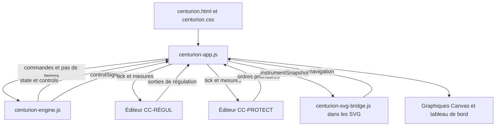

# Centurion — note de conception

Version documentaire du 6 octobre 2026. Cette note décrit le code présent dans le dépôt ; les numéros de ligne et le catalogue des interfaces sont régénérés par `node scripts/generate-docs.mjs`.

## 1. Objet et périmètre

Centurion est un simulateur pédagogique interactif de REP 1300 à quatre boucles. Une seule instance du moteur alimente les synoptiques, les historiques, les instruments et les deux ateliers de contrôle-commande. L'élève peut modifier les paramètres physiques, construire des régulations, provoquer des événements et observer leurs conséquences.

Le logiciel est une application statique : HTML, CSS, JavaScript, SVG et Canvas. Il fonctionne depuis un dossier local ou un hébergement statique. Il ne possède ni serveur de calcul, ni compte utilisateur, ni service de stockage distant. GitHub Pages publie les mêmes fichiers que ceux utilisés localement.

La simulation combine une cinétique neutronique globale, une forme axiale à 32 mailles, des bilans thermiques et des capacités hydrauliques équivalentes. Les transitoires accidentels, le DNBR et les critères de fin de partie sont des modèles d'exercice. Ils ne constituent pas un calcul de sûreté qualifié.

### Vues et parcours

| Ensemble | Contenu |
| --- | --- |
| Synoptiques | RCP général, Cœur, Diagramme P–T, Inventaire CPP, Pressuriseur, Grappes, GV sélectionné de 1 à 4 |
| Graphique | Historiques avec unités physiques, fenêtres de 5 min, 30 min, 1 h ou 4 h et navigation temporelle |
| CC-RÉGUL | Construction et exécution des chaînes de température, GCP, niveaux GV, pression et charge RCV |
| CC-PROTECT | Construction des logigrammes AAR, IS et démarrage ASG |
| Initiateurs | Brèche, éjection, retrait intempestif et perte de tension, après un décompte réel de 5 s |
| Transitoires | Programmes de charge, pause/reprise/interruption ; seul le suivi de charge boucle |
| Modèle | Détails par chapitres (cette note), seuils d'alarme et paramètres physiques modifiables |

## 2. Architecture logicielle



### Responsabilités des fichiers

| Fichier | Responsabilité | Dépendances |
| --- | --- | --- |
| `centurion-engine.js` | État physique, commandes, évolution, instruments, événements et historiques | JavaScript seul ; export CommonJS ou `window.CenturionEngine` |
| `centurion-app.js` | Horloge navigateur, conduite manuelle, arbitrage des sorties CC, navigation et dessins Canvas | Moteur, DOM, Canvas, fenêtres des éditeurs et SVG |
| `centurion-history.js` | Catalogue des mesures, courbes libres, axes, sélection temporelle et lectures figées | Moteur en lecture seule, DOM et Canvas ; fonctions pures exportées pour les tests |
| `centurion-cc-regul.html` | Palette de blocs, graphes, évaluation, édition et sauvegarde | DOM, stockage local, messages du parent ; deux instances selon `mode` |
| `centurion-svg-bridge.js` | Application des mesures aux objets SVG, animations et renvois | DOM SVG et messages du parent |
| `centurion.html` / `centurion.css` | Structure des onglets, pupitre commun et présentation adaptative | Les trois scripts applicatifs et les fichiers SVG |
| `synoptiques/liaisons.json` | Inventaire des liaisons graphiques, utilisé pour vérification | Tests et documentation ; pas un moteur de calcul |
| `references.html` | Catalogue public de références sous identifiants REF-01 à REF-08 | Les documents sources eux-mêmes restent locaux |
| `tests/` | Tests du moteur, du vrai évaluateur CC et de l'intégration sur surfaces DOM/SVG simulées | Modules intégrés de Node.js |

Le RCP général, le pressuriseur, les grappes, le GV, l'inventaire et le diagramme P–T sont six fichiers SVG. Les quatre GV utilisent un même fichier avec substitution du numéro de train. La vue Cœur est un dessin Canvas ; elle n'a pas de SVG externe.

### Chargement

`index.html` redirige vers `simulateur/centurion.html`. Le moteur est chargé avant l'application. Celle-ci crée `model = CenturionEngine.make()`, raccorde les commandes, ouvre les vues et démarre sa boucle `requestAnimationFrame`.

Les deux éditeurs sont des iframes de la même page, respectivement `?mode=regul` et `?mode=protect`. La connexion est renouvelée à leur événement `load`. Les échanges `connect` / `ready` permettent aussi le raccordement si l'un des documents était déjà prêt. Chaque SVG contient le script de liaison et annonce son chargement au parent.

Au départ, l'horloge est en pause, CC-RÉGUL est désactivé et CC-PROTECT est activé. L'absence de régulation ne coupe pas la physique des équipements ni les manœuvres explicitement automatiques de l'exercice.

## 3. Modèle de données et conventions

L'objet racine est `{ state, controls }`. Les fonctions d'évolution modifient cet objet sur place. `state` contient les grandeurs réalisées et les mémoires du modèle ; `controls` contient les demandes, disponibilités et paramètres choisis. Un débit commandé ne doit jamais remplacer directement le débit mesuré dans une vue.

### État physique principal

| Chemin | Unité / format | Sens |
| --- | --- | --- |
| `state.time` | s simulées | Horloge physique |
| `powerPct` | % PN | Puissance neutronique de fission ; distincte de la puissance résiduelle |
| `fissionMW`, `decayMW`, `thermalPowerMW` | MWth | Fission, chaleur résiduelle et somme thermique |
| `electricMW` | MWe | Puissance réseau ; plafonnée à 1 300 MWe |
| `demandPct`, `turbinePct` | % | Demande et réponse turbine |
| `pressureBar` | bar absolus | Pression primaire |
| `tavgC`, `hotC`, `coldC`, `tRicC`, `lidC`, `fuelC` | °C | Moyenne primaire, BC, BF, sortie cœur avant bypass, couvercle et combustible |
| `primaryMassKg`, `vaporMassKg` | kg | Masse totale primaire et masse de vapeur retenue |
| `primaryEnergyJ`, `vaporEnergyJ` | J | Énergie primaire et contribution latente |
| `boronPpm`, `boronInventory` | ppm ; ppm·kg | Concentration du liquide et inventaire associé |
| `rods.R`, `rods.G1`, … | pas extraits | 0 = entièrement inséré ; 260 = entièrement extrait |
| `g3Count` | pas de chevauchement | Compteur condensé G1–G2–N1–N2 ; 780 au point tout extrait |
| `loops[0..3]` | tableau de 4 objets | Débits forcé/naturel en kg/s, températures, HMT et état de chaque GMPP |
| `gv[0..3]` | tableau de 4 objets | Masse secondaire, température/pression, niveaux, ARE/ASG et sorties vapeur |
| `axialShape32` | 32 valeurs sans dimension | P(z), moyenne arithmétique égale à 1 ; ordre du bas vers le haut |
| `iodine32`, `xenon32` | concentrations relatives | Stocks locaux, rapportés à l'équilibre nominal du modèle |
| `axialZonePowerPctPn32` | % PN par maille | Somme égale à `powerPct` |
| `fluxDetectors6` | 6 valeurs relatives | Moyennes idéales de la forme sur six sections RPN |
| `dpaxPctPn` | % PN | Somme des trois sections hautes moins somme des trois sections basses |
| `linearWcm32`, `peakLinearWcm` | W/cm | Profil de puissance linéique avec Fxy et maximum |
| `fDeltaH`, `dnbr` | sans dimension | Facteur d'élévation d'enthalpie et indicateur DNBR simplifié |
| `tripDemandAt`, `tripAt`, etc. | s ou `null` | Horodatage d'une demande, puis de son effet physique |
| `history`, `events` | tableaux | Échantillons physiques et journal d'événements |
| `endState` | `null`, `melted`, `safe` | État de fin de partie |

Les variables publiques du moteur ne sont pas toutes reprises dans ce tableau. Le [catalogue généré](index.html#api) donne les signatures exportées ; le dictionnaire complet des signaux CC est généré à partir de `controlSignals(make())`.

### Commandes et paramètres

| Famille | Exemples dans `controls` |
| --- | --- |
| Turbine | `demandPct`, `manualTurbineTargetPct`, `manualTurbineRatePctMin`, état du transitoire |
| Grappes | `rMode`, `rManualPas`, `rGraphPas`, `rManualOverride`, `allRodsTargetPas`, `g3GraphTarget`, `gcpCalibrationPct` |
| GV | `gvManualFeedPct[4]`, `gvGraphFeedPct[4]`, `gvSteamValvePct[4]`, `gvLevelSetpointPct`, `gctAOpeningPressureBar` |
| PZR | `manualHeaterKW`, `manualSprayPct`, `pressureGraphHeaterKW`, `pressureGraphSprayPct`, `manualReliefStages[3]`, `manualAuxiliarySprayM3h` |
| RCV | `rcvChargeM3h`, `rcvChargeGraphM3h`, `rcvTankBoronPpm`, `rcvLetdownOrifices[3]`, `rcvInjectionMode`, `rcvInjectionGraphMode` |
| Sauvegarde | `asgManual`, `asgTrainEnabled[4]`, `risPumpMode`, `risSourceMode`, disponibilités MP/BP |
| Physique | `rodWorthPcm`, `axialRodAbsorption`, `coolantWorthPcmC`, `dopplerWorthPcmC`, `xenonEquilibriumWorthPcm`, `fxYUngraped`, `fxYGraped` |

Une sortie CC absente prend généralement la valeur `null`, pour laisser la conduite manuelle correspondante. Une sortie nulle est une commande valide : elle ne doit pas être confondue avec une sortie absente. Les commandes PZR sans nouvelle sortie finie maintiennent leur valeur précédente tant que le mode graph reste sélectionné.

### Projection instrumentale

`instrumentSnapshot(model, selectedGv)` construit la projection commune aux instruments. Il renvoie notamment `gvState` pour le GV choisi, `gvAll`, `loops`, `rods`, les débits convertis, les indicateurs de niveau et les alarmes de domaine. Les numéros de GV sont compris entre 1 et 4 ; les tableaux JavaScript commencent à l'indice 0.

Cette projection ne constitue pas une copie profondément immuable de tout le modèle : certains objets comme `inventory` sont partagés avant l'envoi. `postMessage` copie les données entre documents. Les consommateurs doivent les lire, pas les utiliser comme commandes ni modifier l'état source.

## 4. Horloge et séquencement

### Boucle du navigateur

L'application accumule le temps réel multiplié par la vitesse sélectionnée, puis appelle `step(model, 0.1)` autant de fois que nécessaire. Un paquet est limité à 150 pas, soit 15 s simulées par image navigateur. Le delta réel par image est plafonné à 0,15 s. Ce mécanisme évite une accumulation sans limite après une suspension de l'onglet.

Chaque sous-pas physique de 0,1 s est suivi d'une évaluation des deux CC actifs avec les mesures actualisées et le même pas de 0,1 s. Les sorties de régulation sont appliquées avant les ordres prioritaires de protection ; elles servent au pas physique suivant. Le facteur ×1 à ×200 et la cadence des images ne modifient ni le pas des filtres ni celui des intégrateurs.

Sur un hébergement de même origine, l'application appelle directement `CenturionCC.receive` dans les deux éditeurs. Pour les fichiers locaux dont les documents ont une origine opaque, elle utilise les mêmes commandes par `postMessage`, avec un `tickId` commun : aucun nouveau pas physique n'est exécuté avant les réponses des CC actifs. Les réponses retardées d'une partie réinitialisée sont ignorées. Le calcul des blocs est identique dans les deux modes ; aucune autre régulation n'est substituée au graphe de l'étudiant.

Le dessin est rafraîchi environ toutes les 120 ms réelles. Les ticks d'affichage utilisent `dt=0` et `displayOnly=true`, aussi bien en marche qu'en pause : affichages et changements de paramètres restent visibles, sans faire évoluer les mémoires dynamiques des blocs. Les ticks de calcul utilisent `refresh=false` pour éviter un redessin des ateliers à chaque sous-pas.

### Ordre d'un pas physique

1. Évolution du programme turbine, TREF, IL de R, paramètres RCV et brèche.
2. Évaluation des informations de protection et réalisation des demandes déjà mémorisées.
3. Mouvement des grappes, réactivité globale et cinétique ponctuelle.
4. Fission, chaleur résiduelle et inventaire servant au débit des boucles.
5. Débits forcé/naturel, échange combustible–primaire, bilans des quatre GV et température combustible.
6. Brèche, RIS, accumulateurs, transit des injections RCV/RIS et bilan masse/bore/énergie primaire.
7. Actionneurs PZR, pression, séparation sensible/latent, températures BF/BC/RIC/couvercle.
8. Iode/xénon, forme axiale, PLIN, DNBR, domaines, critère de dommage.
9. Incrément d'horloge et éventuel échantillon historique.

Les couplages utilisent ainsi des états successifs à l'intérieur du pas. Il ne s'agit pas d'une résolution simultanée de toutes les équations. `advance(model, seconds, dt)` est un outil de calcul sans interface : il répète les sous-pas physiques et n'exécute pas les graphes CC du navigateur.

### Historiques et temporisations

Un échantillon est enregistré environ chaque seconde simulée ; la mémoire conserve au plus 28 800 échantillons, soit environ 8 h. Les fenêtres de 5 min à 4 h filtrent cette mémoire sans changer le pas physique. Le journal conserve les 240 derniers événements.

L'onglet **Graphique** propose 259 variables : mesures physiques, températures/débits des quatre boucles et GV, actionneurs, stocks d'eau, poisons, composantes de réactivité et les 48 sources transmises aux ateliers CC. Les huit listes historiques sont des présélections modifiables. La recherche accepte nom, repère, nom interne, famille et unité. Une courbe peut être masquée sans être retirée ; couleur, échelle adaptative ou bornes fixes se règlent dans sa ligne. Chaque courbe visible dispose d'un axe de sa couleur, à gauche. Au-delà de la largeur disponible, les axes et courbes se parcourent horizontalement. La limite de 32 courbes simultanées évite une image Canvas excessivement large.

L'aperçu montre tout l'historique conservé et une fenêtre de sélection. Glisser les bords règle début/fin ; glisser le centre déplace la fenêtre ; tracer une nouvelle sélection hors de la fenêtre choisit une période. Les champs HH:MM:SS, deux glissières et boutons précédent/suivant offrent aussi une navigation clavier. **Revenir au direct** fait avancer la fenêtre avec la simulation. Une période choisie reste fixe, indépendamment du curseur de lecture.

Le curseur lit l'échantillon réel le plus proche, sans interpolation temporelle. La ligne verticale est commune aux deux graphes, et les valeurs sont affichées près des axes et dans la liste. Un clic, Entrée ou le bouton **Figer le curseur** conserve l'instant et ses valeurs ; **Défiger** reprend le suivi. Les flèches gauche/droite parcourent les échantillons. Le tableau figé contient les courbes visibles plus la réactivité du panneau inférieur. **Copier le tableau** produit du texte tabulé avec virgule décimale, prêt pour un tableur ; une zone sélectionnable prend le relais si le presse-papiers n'est pas disponible. Le graphe de réactivité possède une échelle indépendante, des graduations et des bandes visuelles ±200/±300 pcm, sans créer de protection supplémentaire.

`historyPoint(model)` centralise l'échantillon sans avancer la physique. Les mesures supplémentaires sont enregistrées dans des tableaux compacts versionnés (`detailVersion = 1`, ordre `HISTORY_PATHS`, sources CC dans leur ordre déclaré), à huit chiffres significatifs. Les champs historiques existants gardent leur précision. Une ancienne sauvegarde ne contient pas ces mesures supplémentaires : leurs courbes commencent au premier nouvel échantillon et leurs anciennes valeurs restent « — ». La sélection, les bornes et la lecture figée sont incluses dans l'état JSON ; les sauvegardes anciennes restent compatibles. La limite de fichier est portée à 160 Mo pour permettre huit heures d'historique enrichi.

Le décompte de lancement d'un initiateur dure 5 s **réelles**. Les délais AAR/IS/ASG, transits, décroissance résiduelle et seuil de dommage sont exprimés en **secondes simulées**. Pendant le décompte de dommage, l'application force ×1 et abandonne le reliquat de temps accéléré.

## 5. Lois physiques implémentées

### 5.1 Réactivité globale et cinétique

La réactivité est la somme suivante, en pcm, relative au point nominal initial :

```text
rho = rho_grappes + alphaB × (CB − CB0)
    + alphaM × (TMOY − TMOY0) + alphaD × (TCRA − TCRA0)
    + WXe_nominal − WXe_nominal × moyenne(Xe)
```

Les coefficients modérateur et Doppler sont signés. Les valeurs par défaut sont −30 pcm/°C et −2,6 pcm/°C. Le bore initial vaut 1 200 ppm, avec −7 pcm/ppm. Le xénon à l'équilibre nominal vaut 3 000 pcm d'antiréactivité ; le terme de référence compense ce poids au point initial et ne suit pas le stock de xénon lors d'un transitoire.

La puissance est calculée par une cinétique ponctuelle à six groupes de précurseurs. Le schéma emploie un dénominateur implicite pour la population neutronique, puis une mise à jour implicite des précurseurs. Le code borne la réactivité injectée dans ce calcul entre −0,15 et 0,012 (sans dimension) et la puissance entre un plancher numérique et 300 % PN. Ces bornes protègent le modèle réduit ; elles ne décrivent pas une saturation physique générale du réacteur.

### 5.2 Grappes et G3

L'efficacité d'un groupe utilise une courbe intégrale en S :

```text
F(p) = (1 − cos(pi × p / 260)) / 2
rho_grappes = somme[ Wg × (F(pg) − F(pg_initial)) ] + effet_ejection
```

R commence à 233 pas extraits ; les autres groupes à 260. Les poids par défaut sont R 1 500, G1 200, G2 480, N1 750, N2 1 200, SA 500, SB 700, SC 900 et SD 300 pcm. Ils sont des paramètres d'étude choisis pour ce simulateur.

G3 est une table interpolée selon la puissance vue et la campagne. Son ancrage à 100 % est 780 pas de chevauchement. Les quatre positions sont obtenues à partir de `counter − 520` et des décalages `[0, 185, 360, 515]`, puis limitées à 0–260 : les recouvrements sont 75, 85 et 105 pas. Il n'y a pas d'IL GCP dans cet exercice.

L'IL de R vaut `202 − 0,16 × P` en première moitié de cycle et `211 − 0,13 × P` en seconde moitié. Son franchissement déclenche un clignotement ; il ne bloque pas le mouvement. La limite droite DPAX est la ligne brisée `(0,0) → (15,15) → (6,100)`, avec DPAX en abscisse et puissance en ordonnée.

### 5.3 Forme axiale et poisons

La hauteur active de 4,2672 m est divisée en 32 mailles. Un opérateur tridiagonal de diffusion/absorption 1D répartit la puissance ; son mode fondamental positif est obtenu par itération inverse, au maximum 60 itérations, et normalisé à une moyenne de 1.

L'absorption locale dépend de l'insertion des grappes, du xénon et de l'écart de température du modérateur. Les coefficients de forme axiale des groupes sont **distincts** des poids intégraux en pcm. Leur modification change la distribution et le DPAX sans ajouter une seconde efficacité au bilan neutronique global.

Les six détecteurs idéaux intègrent les recouvrements entre les 32 mailles et leurs six sections. La courbe affichée est lissée par interpolation cubique préservant les extrema. L'interpolation est graphique ; elle ne remplace pas les 32 valeurs de calcul.

Le modèle local des poisons utilise :

```text
dI/dt  = lambdaI × (puissance_locale_relative − I)
dXe/dt = facteur_production × (lambdaXe + capture_nominale) × I
       − (lambdaXe + capture_nominale × puissance_locale_relative) × Xe
```

Les demi-vies sont 6,6 h pour l'iode et 9,1 h pour le xénon. La production d'iode suit immédiatement la puissance ; son **stock** garde la mémoire de cette irradiation. La moyenne Xe agit sur la réactivité globale, tandis que sa distribution agit sur la forme. La préparation du point initial recherche un équilibre axial couplé. Le facteur `timeScaleXenon` est distinct de la vitesse générale et vaut 1 au départ.

### 5.4 Puissance linéique et DNBR

À chaque maille, une table Fxy est sélectionnée suivant les groupes qui occupent cette cote. L'occupation partielle de la maille traversée par une pointe est interpolée. La valeur non grappée par défaut est 1,4 ; le multiplicateur de la table grappée est 1. La cote 0 prolonge la cote 1 de la table fournie. Une correction d'étude `1 + 0,3 × (1 − puissance_thermique_relative)` est appliquée à puissance inférieure au nominal.

```text
Q(z) = P(z) × Fxy(z)
PLIN(z) = 170,23 × (Pthermique / 3817) × Q(z)       [W/cm]
FDeltaH = moyenne[Q(z)]
FQ = max[Q(z)]
```

Le DNBR est un indicateur local utilisant la pression, le débit et le sous-refroidissement du canal chaud, puis normalisé pour donner 1,65 au nominal. Son minimum sur 32 mailles est affiché. Le calcul d'enthalpie utilise Cp constant et suppose les facteurs de mélange/redistribution égaux à 1. Aucune corrélation industrielle complète de flux critique n'est implémentée.

Le dessin de P(z) a une échelle fixe 0–2 ; les 32 barres PLIN utilisent 0–435 W/cm. Le seuil de protection est 435 W/cm ; le seuil de fin de partie est 590 W/cm pendant plus de 5 s.

### 5.5 Combustible, primaire et changement de phase

L'échange combustible–primaire est `Q = K × (TCRA − TMOY)`, avec K fixe à 10 MW/°C et capacité thermique combustible de 45 MJ/°C. La même puissance est retirée du combustible et ajoutée au primaire. Le combustible peut dépasser la température de saturation ; les températures d'eau sont limitées à cette saturation.

Le primaire a un inventaire nominal de 269 064 kg, Cp effectif 6 000 J/(kg·°C) et débit nominal total de 17 588 kg/s. Il n'est pas multiplié par quatre. Les bilans comptent les injections arrivées, les décharges, la brèche et les soupapes. La température moyenne est déduite de l'énergie ; l'énergie excédant le liquide saturé devient une contribution latente et une masse de vapeur.

La pression et la température de saturation utilisent les équations directes et inverses de la région 4 IF97. La densité liquide dépend de T et P (région 1 IF97 jusqu'à 350 °C) ; les densités saturées suivent SR1-86(1992). Au-delà de 350 °C, la correction de compression liquide est une extension d'étude, pas une implémentation de la région 3. Cp reste effectif et constant, et la chaleur latente primaire est interpolée : le bilan énergétique n'est donc pas une EOS IF97 complète.

Le calcul BF/BC retire la contribution de vaporisation à la chaleur sensible et borne l'écart de température par la saturation. Il ne divise pas par un débit nul. T RIC est la température moyenne de sortie cœur avant le mélange avec 7 % de bypass ; les branches chaudes représentent la sortie après mélange. La température du couvercle est bornée par la saturation.

La chaleur résiduelle est séparée de la puissance neutronique : après AAR ou arrêt normal identifié par la commande de tous les groupes, elle suit une loi d'étude commençant vers 7 % du nominal et décroissant en `(1 + temps_depuis_arret)^−0,2`. Cette chaleur chauffe réellement le combustible.

Chaque GMPP alimentée ajoute **6 MW thermiques à l'eau primaire**, soit **24 MW avec les quatre pompes**. Cette approximation d'exercice est cohérente avec le couple de 39 507 N·m à 1 480 tr/min de REF-01, tableau 43, p. PDF 120 (6,12 MW mécaniques). Le terme `pumpHeatMW` entre une seule fois dans `ΔU_CPP = (échange_combustible + chaleur_GMPP − échange_GV) × Δt + enthalpie_entrées − enthalpie_sorties`. Il n'entre ni dans le bilan combustible, ni dans POW1, PTHC, la chaleur résiduelle ou le calcul PLIN ; ses effets sur les températures puis la réactivité restent ceux des contre-réactions du modèle.

L'apport de chaque pompe vaut 6 MW tant que son entraînement reste alimenté, indépendamment de PTUR et du débit naturel. Il devient nul dès le déclenchement de cette pompe ; un AAR seul laisse les GMPP en marche. Le débit forcé conserve son inertie après coupure, sans entretenir artificiellement les 6 MW. La dissipation de l'énergie cinétique du rotor et du circuit pendant le ralentissement n'est pas résolue. La puissance déposée n'est pas réduite en cas de désamorçage : l'échauffement d'une pompe à sec n'est pas modélisé. Le tableau de bord et l'inventaire affichent le total et les contributions de boucle ; les instantanés et l'historique les conservent.

### 5.6 Débits primaire, thermosiphon et inventaire

En marche, une GMPP vise le débit nominal de sa boucle. Une baisse turbine ne doit pas diminuer ce débit. Un arrêt mémorisé des GMPP résulte d'une perte de tension ou d'une demande IS ; l'AAR seul ne les arrête pas. Le débit forcé décroît avec une constante de 15 s et est mis à zéro sous 2 % du nominal, soit environ une minute de décélération.

La circulation naturelle dépend de l'écart thermique primaire–GV, du niveau secondaire, de la couverture cœur et de l'amorçage de la boucle. Elle prend progressivement le relais du débit forcé, autour de 250 kg/s par boucle, au maximum 300 kg/s. Le RIS livré participe au débit cœur ; sur une brèche BF, l'exercice suppose un court-circuit de 50 % de l'injection de la boucle rompue, soit 12,5 % du débit total.

`cppInventory` distribue la masse liquide dans des capacités équivalentes selon leur altitude. Le PZR absorbe d'abord la variation normale, les boucles restant pleines. Une surface libre schématique descend dans les capacités après épuisement de cette réserve. Les quatre faisceaux ont des altitudes légèrement décalées pour représenter un désamorçage progressif. Cette géométrie est un modèle de visualisation et de capacité, pas une description dimensionnelle certifiée.

#### Bilan massique visible

`primaryMassBalance(state)` expose les débits **réalisés à la frontière du CPP**, en kg/s. Les apports MP, BP et accumulateurs conservent leur origine pendant leur transit. Le débit pompé peut donc différer temporairement du débit arrivé. La charge RCV comprend les retours des joints regroupés dans l'inventaire équivalent.

```text
dM_CPP/dt = charge_RCV_arrivée + RIS_MP_arrivée + RIS_BP_arrivée
         + accumulateurs_arrivés − décharge_RCV − brèche_totale − soupapes_PZR
M_CPP = M_liquide + M_vapeur
dM_vapeur/dt = changement_de_phase_net − vapeur_brèche − vapeur_soupapes_PZR
dM_liquide/dt = dM_CPP/dt − dM_vapeur/dt
```

Le changement de phase net inclut détente et condensation ; il peut être négatif. Il se distingue du débit de vaporisation calculé à partir de la chaleur transférée au cœur. Le débit total de brèche contient déjà ses parts liquide et vapeur : ne pas lui ajouter une seconde fois la vapeur produite. Aspersion normale et RRA sont des circulations internes ; l'aspersion auxiliaire détourne une part de la charge déjà comptée. ARE et ASG alimentent le secondaire et ne constituent pas une entrée d'eau primaire.

Le panneau du synoptique Inventaire CPP montre entrées, sorties, solde, variations des stocks liquide et vapeur, densité, volume occupé et volume libre. Les m³/h RCV sont convertis avec la densité liquide à la température du débit et à la pression primaire ; RIS utilise 1 000 kg/m³. Les soupapes sont affichées en équivalent liquide, la brèche avec la densité de sa loi d'écoulement. Un débit diphasique n'est pas un volume réel de vapeur. Comparer les kg/s pour fermer le bilan.

Chaque ligne donne aussi la **température et la CB**. Les injections utilisent les caractéristiques des parcelles réellement arrivées après transit, avec pondération massique si deux sources se mélangent pendant une bascule. Les prélèvements liquides emploient TMOY et la CB au début du bilan homogénéisé ; la vapeur rejetée est indiquée à saturation et à 0 ppm de bore. Les totaux sont des moyennes pondérées des débits ; les conditions ne sont pas affichées quand le débit est nul. La température équivalente de charge RCV reste celle du modèle primaire simplifié, sans échangeur RCV détaillé.

`primaryFlowDiagnostics(model)` donne les débits forcé, naturel et total de chaque boucle, le débit RIS traversant le cœur et leur somme. L'affichage explique les facteurs effectivement employés : amorçage, couverture du cœur, inventaire secondaire, écart TMOY−TGV et brèche locale. Le désamorçage commence dans les 0,30 m sous le sommet du faisceau et devient total sous cette bande, selon la géométrie d'étude. Un GV sans eau ou TMOY≤TGV annule également le thermosiphon. L'arrêt électrique et la perte d'amorçage sont distingués ; le débit RIS peut rester positif même avec les quatre thermosiphons perdus.

Une pression stable n'impose pas `dM_CPP/dt = 0` : contraction thermique et changement de phase modifient aussi le volume. En revanche, le stock ne peut plus s'accumuler dans un volume déjà plein sans comprimer le liquide et monter en pression. Le calcul à volume fini de §5.8 remplace la précédente loi linéaire à capacité massique constante. L'inventaire ne retire aucune masse pour faire disparaître un excès : il emploie la même densité et la même pression que le bilan physique.

### 5.7 GV et vapeur

Chaque GV possède sa masse et son bilan d'énergie : capacité d'eau variable plus 100 MJ/°C de métal équivalent. La masse secondaire nominale est d'environ 63,8 t par GV. L'inventaire primaire est compté dans le bilan primaire, pas ajouté une seconde fois à cette capacité.

L'échange primaire–GV dépend de l'écart TMOY–température secondaire, du débit de la boucle et de l'inventaire secondaire. ARE apporte de l'eau à 245 °C ; ASG à 20 °C. La vapeur évacuée emporte l'enthalpie sensible et une chaleur latente effective dépendant de la pression. La pression secondaire est déduite de la température par la saturation.

Le permanent initial évacue **3 841 MW par les quatre GV**, soit 3 817 MW du cœur et 24 MW des GMPP (960,25 MW par GV). La conductance est recalée sur ces 3 841 MW à TMOY = 306,5 °C et P_GV = 65 bar. Le débit nominal de 530,14 kg/s par GV et le plafond réseau de 1 300 MWe sont conservés ; l'enthalpie effective d'évacuation secondaire est ajustée de 1,8 à **1,81132 MJ/kg**, d'où Lv effectif à 65 bar ≈ 1,66071 MJ/kg. Ce calage ferme les deux bilans au démarrage ; il reste une approximation et ne remplace pas une équation d'état secondaire complète. Le signal PGV, rapporté aux 3 817 MW du cœur, affiche donc 100,63 % PN au nominal.

Le débit vapeur total d'un GV est la somme VPU + GCT-A. Le limiteur turbine plafonne le débit utilisé par la turbine à sa demande et la puissance réseau à 1 300 MWe. Une hausse de puissance cœur ne relève pas cette consigne. La pression peut limiter la vapeur réellement disponible.

La sortie facultative **LIM. TURB.** (`turbineLimitOut`) reçoit un plafond en %, borné à 0–100. Quand le CC-RÉGUL est actif, la consigne turbine admise vaut `min(demande PTUR, plafond)`, pour la conduite manuelle comme pour les programmes de charge. La demande d'origine est conservée ; une remontée du plafond autorise donc la reprise de charge jusqu'à cette demande. Le mouvement turbine garde sa limite de 4 %/s, sauf le mode manuel Instantanée décrit ci-dessous ; l'arrêt turbine prioritaire impose toujours zéro. Le programme thermique et la puissance vue par les GCP suivent la consigne admise ; PTUR reste la mesure de puissance turbine réalisée. Déconnecter la sortie ou désactiver CC-RÉGUL rétablit le plafond de 100 %.

La glissière manuelle PTUR fixe une cible de puissance. Le sélecteur à sa droite impose une pente de **0,5, 1, 2, 5, 10 ou 200 points de pourcentage par minute simulée**, dans les deux sens ; **5 %/min** est le réglage initial. La demande appliquée avance de `pente × dt / 60` au maximum à chaque pas, sans dépasser la cible. Modifier la cible ou la pente pendant le mouvement reprend à la consigne courante. Le mode **Instantanée** applique la nouvelle demande et la réponse turbine au prochain pas physique, sous réserve du plafond et de l'arrêt turbine prioritaires. En pause, la cible peut être préparée mais la rampe reste immobile. Le programme de température, les entrées CC et l'historique suivent la consigne progressive appliquée. La cible reste affichée sur la glissière et la consigne en cours apparaît dessous. La pente et une rampe en cours sont conservées dans la sauvegarde JSON.

Pendant un programme de charge, glissière et sélecteur de pente sont désactivés ; le programme conserve ses propres pentes. Son lancement annule la cible manuelle précédente. À sa fin ou après interruption, la commande est rendue à sa valeur courante, sans reprendre une ancienne rampe. Les anciennes sauvegardes sont chargées sans rampe en attente, avec le sélecteur réglé à 5 %/min.

Les GCT-A modulent autour de leur pression d'ouverture manuelle, 88,6 bar au départ. Leur capacité maximale et leur bande sont des lois d'étude. ARE s'arrête après AAR ou perte de tension. ASG démarre sur ordre CC-PROTECT ou manuel ; l'AAR n'ajoute pas un second démarrage caché dans le moteur.

Le débit ASG par GV interpole 127, 140, 152, 157 m³/h aux pressions 80, 60, 40, 30 bar ; hors plage, les extrêmes sont maintenus. Deux trains sont de type TPS et deux MPS. Les MPS attendent le secours diesel en perte de tension ; les TPS restent disponibles. Le haut niveau GE >90 % coupe aussi le manuel ; en automatique, la reprise sous 10 % suppose un ordre ASG préalablement réalisé.

### 5.8 PZR et RCV

#### Volume fini et effet piston

La géométrie équivalente est recalée sur **269 064 kg à 306,5 °C et 155 bar**, avec niveau PZR 42 %. Sa capacité totale vaut environ **401,05 m³**. Pour l'inventaire, `V_liquide = M_liquide / rho(TMOY, P)` ; refroidir l'eau augmente sa densité et libère du volume. Un affichage à densité fixe pouvait donc annoncer un excès fictif dans un CPP refroidi.

À chaque sous-pas, le moteur conserve la masse injectée et recherche la pression satisfaisant :

```text
V_liquide(P, énergie) + V_vapeur_de_détente(P, énergie)
  + V_poche × (P_reference / P)^(1/n) = V_CPP
```

La poche équivalente représente l'effet piston : une insurge ou une dilatation la comprime, une outsurge la détend. `n = 1,2` est une hypothèse polytropique d'étude. Une fois le volume libre nul, le terme de poche disparaît ; la dépendance de `rho` à P gouverne la pression du circuit plein d'eau. L'algorithme utilise une recherche encadrée avec Newton, sans changer le sous-pas de 0,1 s à ×200.

La réponse rapide comprime ou détend la poche suivant la loi polytropique. La réponse plus lente tient compte de la vapeur saturée, de l'eau chaude et des parois qui peuvent fournir ou absorber la chaleur d'un changement de phase. Une insurge comprime la vapeur ; une outsurge la détend, puis une partie de l'eau chaude se vaporise pour amortir la chute de pression. L'eau d'insurge ne refroidit pas instantanément toute la réserve chaude : la stratification reste représentée par une capacité participante effective. Ces mécanismes sont décrits et comparés à des essais dans la [référence publique sur les transitoires de pressuriseur, chap. 2](https://publications.vtt.fi/pdf/tiedotteet/2006/T2339.pdf).

La pression thermique de référence utilise **la même compliance** pour le déplacement et pour les chaufferettes/aspersions :

```text
L = 1/rho_vapeur − 1/rho_liquide_saturé
C_phase = C_thermique × (dTsat/dP) / Lv × L
C_eq = C_liquide_CPP + C_vapeur_saturée + C_expansion_eau_chaude + C_phase
ΔP_thermique = ΔV / C_eq + (Q_net / Lv) × L × Δt / C_eq
```

`C_eq` est en m³/bar ; `Q_net` est ici en W et `Lv` en J/kg. `C_vapeur_saturée = V_libre / rho_vapeur × d(rho_vapeur)/dP` utilise la variation réelle de densité saturée, et non `V/(nP)`, réservé à la compression rapide. Le terme d'expansion de l'eau chaude est négatif : l'élévation de Tsat augmente son volume. La capacité participante vaut **156 MJ/°C au niveau nominal**, varie avec le niveau PZR et disparaît avec la poche. Ce calage correspond au gradient de pleine aspersion documenté, environ −0,15 bar/s. Au nominal, `C_eq ≈ 0,988 m³/bar` et le gain thermique vaut **0,00851 bar/(MW·s)**. Quand le CPP est plein, ces termes de phase s'annulent : la pression est alors déterminée par la compressibilité du liquide.

La relaxation entre compression rapide et réponse saturée garde une constante de **2 s**. La capacité participante et cette constante sont des hypothèses du modèle réduit, pas des caractéristiques qualifiées d'un pressuriseur. Le travail de compression n'est plus ajouté une seconde fois comme une source externe de chaleur ; chaufferettes et aspersion entrent dans le bilan thermique seulement, sans correction thermique supplémentaire de la poche rapide.

Le bilan thermique conserve son calage nominal (288 kW, deux aspersions continues de 0,230 m³/h) et le gradient de pleine aspersion voisin de −0,15 bar/s une fois la réponse établie. Cette modélisation ne résout pas séparément les masses et enthalpies des couches chaude/froide du PZR : la poche de pilotage reste un volume compressible équivalent, sa masse propre n'est pas ajoutée au stock suivi. La masse « vapeur de détente » affichée correspond à celle du bilan sensible/latent du CPP. Ce modèle reste pédagogique.

##### Brèche, condensation et passage à un CPP plein

La poche polytropique ne représente pas de l'azote emprisonné dans le primaire. Quand la réserve chaude du PZR disparaît, elle se condense progressivement ; la transition utilise les derniers **5 % de niveau PZR** et la constante d'étude de **2 s**. À PZR vide, sa contribution volumique est multipliée par `exp(−dt/2)` à chaque pas. La mémoire thermique est rapprochée de la pression réalisée quand le PZR est vide, quand la vapeur de détente occupe le volume disponible ou quand le CPP est plein. Cela évite qu'une seconde mémoire indépendante atteigne artificiellement 1 bar puis recrée une poche fictive après condensation. Masse, bore et énergie suivis ne sont pas effacés.

Avec une brèche, une eau sous-refroidie et moins de **2 m³ de volume libre**, le moteur résout simultanément la contre-pression, les admissions RIS/RCV et le débit de brèche. Les débits sont évalués à une pression d'essai, les masses et enthalpies admises déterminent le nouvel état, puis la pression est recherchée pour fermer le volume. La recherche utilise Newton encadré ; aucune limitation arbitraire en bar/s n'est ajoutée. Les files de transit conservent les températures, concentrations et masses des parcelles, mais ne retardent pas la réaction hydraulique à la contre-pression. Une parcelle refusée reste en ligne ; un paquet BP bloqué ne bloque pas une admission MP possible.

Les parcelles déjà arrivées, consécutives et de même composition sont regroupées sans supprimer de masse, de bore ou d'enthalpie. Les fronts de composition et les dates d'arrivée futures restent séparés. Cela évite l'accumulation de milliers de reliquats infinitésimaux lors de la fin de vidange des accumulateurs. Les lots de calcul rendent aussi la main au navigateur après environ 30 ms ; les sous-pas physiques et CC restent à 0,1 s, tandis que l'accélération réellement atteinte dépend du coût du calcul.

**Sous 100 °C, une eau liquide peut rester à une pression élevée si le circuit est plein et les pompes injectent contre la brèche.** La pression n'est pas forcée à la saturation. À l'inverse, une poche équivalente dans un CPP vidé et refroidi ne doit pas maintenir à elle seule plusieurs dizaines de bars. La pression extérieure de brèche reste fixée à 1 bar absolu dans cet exercice ; la montée de pression pendant le remplissage d'un volume presque incompressible peut être rapide, mais le régime établi ne doit pas osciller à cause du délai de transit.

L'injection des accumulateurs à **20 °C** peut provoquer une baisse marquée de pression par condensation. Leur débit hydraulique est conservé : volume total 47,6 m³, eau initiale 28,2 m³, azote initial 41,25 bar, exposant 1,35 et `K/A² = 4 100 m⁻⁴` (valeurs médianes de REF-01 §4.11). Ces paramètres correspondent à la loi `ΔP = (K/A²) × q_massique² / (2 rho)` en Pa. Le mélange homogène instantané du CPP peut surestimer la vitesse de refroidissement et de condensation ; les fronts froids, les interfaces locales et la stratification accidentelle ne sont pas résolus. Le seuil d'isolement des accumulateurs mentionné dans la note n'est pas ajouté comme automatisme caché.

Les essais dédiés contrôlent une brèche de 300 cm² sur 20 minutes, le bilan massique incluant les lignes et réserves, les apports de bore et d'enthalpie, le régime froid plein, la condensation d'une poche dans un CPP partiellement vidé, ainsi que la convergence entre des pas de 0,1 et 0,05 s. Ils complètent les essais de pleine aspersion et de rampes thermiques rapides ; ils ne constituent pas une qualification accidentelle du modèle.

##### Vérification des rampes rapides

Une rampe **50 points de % PN par minute**, entre 100 et 15 %, dure **102 s**. Le programme thermique correspondant passe de 306,5 à **298,595 °C**. À masse constante et 155 bar, le volume liquide passe de 377,56 à 368,89 m³ : environ **8,67 m³** quittent le PZR. Le phénomène s'inverse au réchauffement.

Le banc de la boucle pression impose cette trajectoire de température et exécute les blocs réels de la solution CC-RÉGUL, avec les limites et vitesses des organes. Les deux rampes sont récupérées : pression voisine de **146–159 bar**, puis retour à moins de **1 bar de 155** après 600 s de palier, sans recours aux soupapes. Ce banc isole le PZR ; il ne démontre pas que la température du cœur suit instantanément ce programme.

L'essai global avec les solutions complètes montre le réchauffement initial lors de la baisse turbine, puis la contraction pendant le rattrapage neutronique. La descente rapide depuis le nominal atteint environ **160,2 bar**, puis **143,5 bar**, et la pression est récupérée. Le comportement de remontée dépend de l'état de départ : avec la G3 conservée et la vitesse GCP de 72 pas/min, passer de 302,5 à 780 pas demande au minimum **398 s**, contre 102 s pour la rampe turbine. Depuis un état bas préparé à température de référence et pression nominale, R peut buter à 260 pas et une PLIN >435 W/cm déclenche l'AAR alors que la pression remonte déjà vers 145 bar. Après un long palier avec xénon conservé, un autre essai récupère 155,7 bar sans AAR, mais R reste en butée et la température n'a pas retrouvé sa référence. **La récupération de pression ne vaut donc pas validation de l'ensemble de la manœuvre à 50 %/min.** G3, efficacités de groupes, coefficients modérateur/Doppler et protections PLIN restent inchangés.

#### Soupapes et aspersion

Les trois étages de soupapes s'ouvrent automatiquement aux pressions **166, 170 et 172 bar absolus**, puis se referment à **160, 164 et 166 bar**, selon REF-01 §4.8. Chaque étage possède sa propre hystérésis, un délai de 0,3 s et une course linéaire de 1,5 s. Cet automatisme d'organe fonctionne indépendamment de CC-RÉGUL et CC-PROTECT et ne crée pas à lui seul d'AAR ou de CIA. Les commandes manuelles restent disponibles ; une commande manuelle et une ouverture automatique du même organe ne doublent pas son débit.

Leur débit d'étude à pleine ouverture reste 50 × sqrt(P/155) kg/s par étage, multiplié par son ouverture réalisée et limité par la masse disponible. Cette capacité approchée est distincte des seuils et temps documentés. Si le CPP est plein, le rejet devient **liquide**, emporte du bore et ne retire pas une chaleur latente fictive. Le partage est continu dans les derniers 0,4 m³ de volume libre. Le débit réalisé de chaque étage et leur somme sont affichés sur le synoptique PZR ; la somme alimente `qsvpSignal`, le tableau de bord et la sortie du bilan CPP. Les cases manuelles indiquent les ordres manuels, tandis que les positions SVG montrent l'ouverture réalisée, automatique ou manuelle.

Les deux lignes réglantes d'aspersion prennent leur eau en BF1/BF2. À ouverture 100 %, chacune débite 125 m³/h aux conditions nominales ; chacune possède aussi 0,230 m³/h continus. L'ouverture est linéaire en débit à pression motrice nominale, puis multipliée par `sqrt(deltaP / 3,5 bar)`. La pression motrice suit le carré du débit forcé GMPP. L'ouverture évolue à 50 %/s. L'aspersion auxiliaire manuelle détourne jusqu'à 8 m³/h de charge RCV vers le PZR, sans ajouter une nouvelle masse injectée.

#### Courbe de la pompe de charge RCV

La demande QCHARGE, manuelle ou CC, est réglable de **0 à 60 m³/h**. Le point fourni est **44 m³/h à 177 bar**. Faute de courbe complète, la hauteur à débit nul est fixée à **180 bar** et une courbe parabolique d'étude est utilisée :

```text
Q_max(P) = min(60, 44 × sqrt(max(0, 180 − P) / 3))   [m³/h]
Q_réalisé = min(Q_demande, Q_max(P))
```

Le débit tombe continûment à zéro à 180 bar, sans débit minimum imposé artificiellement. Au nominal, la demande reste **36 m³/h**, dont jusqu'à 6 vers les joints et 30 sur la charge directe équivalente. La contre-pression limite aussi l'admission des parcelles déjà en tuyauterie : une parcelle bloquée reste en ligne, avec sa masse, son bore et son énergie. Le transit reste de 8 s ; le débit pompé et celui arrivé peuvent donc différer. L'inventaire et la conduite manuelle distinguent demande, réalisé et capacité disponible.

Les orifices de décharge donnent chacun 18 m³/h ; deux sont ouverts au départ. QCHARGE peut être commandée par le CC de niveau. Les solutions embarquées acceptent 0–60 m³/h ; les graphes personnalisés conservant un limiteur 6–36 gardent ce réglage jusqu'à sa modification par l'utilisateur. La CB réglée reste manuelle. Les boutons dilution/borication imposent temporairement 0/7 000 ppm à la charge existante, restaurent ensuite la CB réglée et comptent les litres **arrivés** après transit.

Une chaîne facultative construite dans CC-RÉGUL peut utiliser les sorties `boricationOut` et `dilutionOut` : valeurs TOR, 1 = marche, 0 = arrêt (seuil 0,5). Elles reprennent la charge existante, sans débit supplémentaire, avec le même transit et les mêmes compteurs. Deux demandes simultanées suspendent l'apport direct et donnent une alarme. Une sortie raccordée remplace les boutons manuels ; désactiver les régulations ou enlever les sorties rend la commande manuelle et la CB réglée. Aucune chaîne de régulation du bore n'est préchargée. Les entrées `posgSignal`, `g3CountSignal` et `gcpCalibrationSignal` donnent respectivement les pas extraits de R, les pas de chevauchement des GCP et le décalibrage manuel en % PN.

Les conversions RCV utilisent `rho(T, P)` ; le RIS froid et l'ASG conservent 1 000 kg/m³. La température de charge demeure celle de la reprise RCV régénérée équivalente, sans modèle détaillé d'échangeur. Les propriétés d'eau reposent sur [IF97](https://iapws.org/technical-guidance/release/IF97-Rev) et [SR1-86(1992)](https://iapws.org/relguide/Supp-sat.html) ; la loi de pompe et les paramètres de phase ci-dessus restent des hypothèses explicites d'exercice.

### 5.9 RIS, accumulateurs et recirculation

Les lois MP/BP dépendent de la pression primaire, des disponibilités, du délai d'ordre, de l'alimentation et du stock de la source. L'injection directe prend la bâche PTR : **2 315 m³ disponibles**, soit 2 315 t avec la densité froide équivalente, à **20 °C et 2 500 ppm** par défaut. Ce volume est le réglage utilisateur de l'exercice. La CB PTR réglable est distincte de l'eau REA à 7 000 ppm utilisée par la borication RCV. La recirculation reprend masse, bore et énergie du puisard modélisé. Les apports arrivent après transit ; les courbes distinguent débit pompé et débit livré.

Les accumulateurs sont des capacités passives avec azote polytropique. La pression d'azote baisse avec la vidange ; le débit suit la racine de la différence de pression positive. Une inertie hydraulique d'étude de 1 s évite une commutation brutale ; le transit vaut 1 s. En fin de réserve, le débit est aussi limité par `M_restante / 3 s`, pour représenter une sortie qui se découvre progressivement, sans effacer la masse restante. Cette constante est une hypothèse d'exercice. L'arrêt manuel des pompes RIS ne ferme pas ces capacités passives. Leur autorisation reste cependant reliée à la demande IS dans le modèle actuel.

La brèche utilise le minimum d'une loi d'orifice et d'un flux critique borné. La densité de sa loi d'orifice et de son affichage en équivalent liquide est calculée à TMOY et à la pression primaire. Un partage liquide/vapeur dépend de la fraction de vide homogène et de la branche rompue. Le puisard reçoit les sorties modélisées ; il n'existe pas de modèle complet d'enceinte.

L'EAS maintient le puisard sous 90 °C (plafond numérique **89,9 °C**). Le moteur enlève explicitement l'énergie excédentaire et affiche la puissance extraite ; masse et quantité de bore restent inchangées. Il s'agit d'une enveloppe de refroidissement sans limite de capacité ni disponibilité EAS détaillée. La collecte conserve la simplification de condensation avec chaleur latente cédée à l'enceinte. Une bascule PTR/recirculation ne modifie pas rétroactivement la température ou la CB des parcelles déjà engagées dans les tuyaux.

## 6. Contrôle-commande et priorité

### Parcours étudiant et corrections

Lors d'une première ouverture, les deux ateliers ont un canevas vide et sont inactifs. L'élève choisit les mesures, assemble les blocs et relie les sorties aux actionneurs. Une sauvegarde existante est restaurée sans être effacée ; sa commande reste inactive au chargement. Le bouton Effacer permet de commencer un nouvel exercice, avec possibilité d'annuler.

Le bouton Solutions ouvre des paliers protégés par un code pédagogique. L'aide-mémoire est rangé dans Modèle → Détails → Compléments, dans un volet fermé. Les codes à quatre chiffres y sont écrits de droite à gauche ; l'étudiant inverse leur ordre avant la saisie. Les solutions sont numérotées de 1 à 6 en régulation et de 1 à 3 en protection. Ces codes organisent le déroulement du TP ; ils ne contrôlent pas l'accès aux fichiers publics.

| Atelier | Paliers |
| --- | --- |
| CC-RÉGUL | Trois historiques : température simplifiée ; température + niveau PZR ; température + niveau + pression PZR. Deux chaînes ciblées : niveaux des quatre GV ; GCP/G3. Enfin Complet : toutes les chaînes, avec les correcteurs G1/G2 de température. |
| CC-PROTECT | Les principaux AAR ; AAR + IS ; AAR + IS + ASG complet. |

Les solutions complètes sont les deux fichiers `modele-de-regulation.simurep_complet.json` et `modele-de-protection.simurep_complet.json`. Leurs blocs, paramètres et positions sont conservés. Les chaînes ciblées et paliers de protection sont extraits de ces graphes. Le premier palier de protection exclut la branche IS et la commande ASG. Le deuxième reprend la branche IS, y compris sa demande d'AAR ; seul le troisième ajoute ASG.

Charger une solution remplace le graphe du seul atelier concerné et désactive sa commande. Une confirmation est affichée si le canevas contient déjà des blocs. Annuler retrouve le travail précédent. Les solutions ciblées remplacent le canevas : elles ne s'ajoutent pas au graphe courant. Aucun ordre de protection n'est greffé automatiquement à un nouveau schéma ou à un palier partiel.

### Évaluateur de graphes

Un graphe comporte des nœuds `{id, type, x, y, label, params}` et des liaisons `{from, to, toPort}`. La palette possède des sources, des opérateurs statiques, des tables, filtres, dérivateurs filtrés, intégrateurs, PI/PID et opérateurs logiques. Les états des blocs dynamiques sont stockés par identifiant de nœud, séparément du modèle sérialisé.

`evaluateRegulationGraph` parcourt les liaisons entrantes, mémorise les résultats du tick et détecte les cycles algébriques. Une valeur finie et une unité accompagnent chaque signal. Les sorties envoyées au parent sont numériques et doivent être connectées. Les diagnostics sont retournés ; une entrée manquante peut valoir zéro selon le bloc, ce qui nécessite une vérification du graphe par son auteur.

Les deux instances ont des graphes, états dynamiques et sauvegardes distincts. Les migrations s'appliquent aux anciennes chaînes identifiables (ancienne sortie de décharge, conversion pas→% ou source dérivée obsolète) et cherchent à préserver les valeurs personnalisées. Le JSON de test historique vérifie ce contrat sans publier l'ancien simulateur complet.

### Chaîne de température de référence

La correction complète conserve la chaîne filtrée et compensée. Ses paramètres restent visibles et modifiables dans les blocs. Les fonctions G1/G2 du correcteur ci-dessous sont distinctes des groupes de grappes portant les mêmes noms.

| Branche | Traitement de la correction complète |
| --- | --- |
| Consigne | PTUR → programme TREF (297,2 à 306,5 °C) → filtre de 60 s |
| Température | TMOY − TREF filtrée → avance–retard (1 + 50s)/(1 + 6,7s) → filtre de 1 s |
| Puissance | POW1 et PTUR filtrés séparément à 2 s → différence → passe-haut de 50 s → G1 × G2 |
| G1, fonction du correcteur | 0,4 °C par % PN près de zéro, puis pente accrue, plateau ±6 °C |
| G2, gain programmé | 4 sous 25 % ; 2 à 50 % ; 4/3 à 75 % ; 1 à 100 % |
| Mouvement R | Somme des deux branches → hystérésis : démarrage à 0,83 °C, arrêt à 0,55 °C |
| Vitesse et position | 8 à 72 pas/min suivant l'écart → inhibition d'extraction à haute puissance → intégration de 0 à 260 pas extraits |

Un écart positif insère R, un écart négatif l'extrait. L'inhibition vise l'extraction ; une insertion commandée reste possible. Le tableau de bord affiche le programme TREF instantané, tandis que l'atelier affiche la TREF filtrée utilisée par la boucle. Avec xénon actif après baisse de puissance, la dilution reste une action manuelle.

### Correspondance sorties → commandes

| Sortie CC | Cible | Conditions / unité |
| --- | --- | --- |
| `posg` | `rGraphPas` | CC-RÉGUL actif, pas extraits 0–260, hors surcharge R manuelle |
| `g3Out` | `g3GraphTarget` | Compteur de chevauchement ; correction de campagne appliquée par le parent |
| `gv1Out` … `gv4Out` | `gvGraphFeedPct` | Ouverture demandée ARE, % |
| `pchauffOut` | `pressureGraphHeaterKW` | Puissance chauffe, kW |
| `qaspOut` | `pressureGraphSprayPct` | Ouverture aspersion, % |
| `nrefOut` | `nrefGraphPct` | Référence niveau PZR, % |
| `qchargeOut` | `rcvChargeGraphM3h` | Demande totale de charge 0–60 m³/h, limitée par la courbe Q(P) de la pompe |
| `turbineLimitOut` | `turbineLimitGraphPct` | Plafond LIM. TURB., borné à 0–100 % ; demande manuelle ou transitoire conservée |
| `aarOut` | demande AAR mémorisée | CC-PROTECT actif ; signal ≥0,5 |
| `risOut` | demande IS mémorisée | CC-PROTECT actif ; signal ≥0,5 ; implique demande AAR et arrêt GMPP |
| `asgOut` | demande ASG mémorisée | CC-PROTECT actif ; signal ≥0,5 |

Au retour manuel, le pupitre reprend les positions et débits réalisés. Les glissières désactivées continuent à suivre les valeurs appliquées. PTUR, le décalibrage GCP et la CB restent manuels. La case R en manuel neutralise seulement la sortie R ; son intégrateur est suivi sur la position réelle pour limiter le saut à la reprise.

### Arbitrage

1. AAR réalisé : chute de tous les groupes et arrêt turbine ; aucune régulation ni commande de levée normale ne peut relever les grappes.
2. IS et perte de tension : effets mémorisés, disponibilités et arrêt GMPP ; les manœuvres RIS/ASG prévues restent accessibles.
3. Commande manuelle de tous les groupes : priorité de manœuvre sur les sorties de position, sans créer d'AAR ni de CIA par elle-même.
4. Surcharge R manuelle : priorité sur R uniquement.
5. Sorties CC actives et finies ; puis commandes manuelles de repli.

Les alarmes du tableau de bord et les clignotements de domaine ne déclenchent pas d'ordres. Les limitations physiques, la temporisation des effets, le GCT-A et la coupure ASG haut niveau demeurent dans le moteur. Un mode de protection interne par seuils existe pour utiliser le moteur seul ; l'application fixe `protectionGraphMode=true` pour faire provenir les ordres automatiques du graphe CC-PROTECT.

## 7. Contrats entre documents et synoptiques

### Messages `postMessage`

| Type | Sens | Charge utile principale |
| --- | --- | --- |
| `centurion-editor-connect` | Parent → éditeur | Demande de raccordement |
| `centurion-editor-ready` | Éditeur → parent | `mode`: `regul` ou `protect` |
| `centurion-editor-enable` | Parent → éditeur | `enabled`, `signals`, éventuellement `rManualOverride` |
| `centurion-editor-enabled` | Éditeur → parent | État de commande après action dans l'atelier |
| `centurion-editor-tick` | Parent → éditeur | `dt`, `signals`, `rManualOverride`, `tickId` pour le calcul ; `displayOnly` pour l'affichage, `refresh` |
| `centurion-editor-outputs` | Éditeur → parent | `mode`, `enabled`, `outputs`, `fluxRatePctS`, `diagnostics`, `tickId` repris de la demande |
| `centurion-editor-reset` | Parent → éditeur | Mesures initiales et état d'activation |
| `centurion-state` | Parent → SVG | Projection instrumentale, courbes/trace P–T si nécessaires |
| `centurion-svg-ready` | SVG → parent | Vue chargée, demande de rafraîchissement |
| `centurion-svg-navigate` | SVG → parent | Nom de vue et numéro GV éventuel |

Le dictionnaire `signals` contient des paires `[valeur, unité]`. Les identifiants logiciels (`pow1`, `posg`, etc.) sont des clés de contrat ; un changement de libellé affiché ne doit pas les renommer. `posg` représente désormais des **pas extraits**. `posgInternalPct` reste une compatibilité interne de l'ancien atelier, pas une unité de conduite.

### Liaisons SVG

Les nouveaux SVG utilisent des attributs sémantiques. `data-value` donne le chemin dans la projection ; `data-template`, `data-decimals` et `data-unit` contrôlent le texte. `data-actuator` et `data-pump` suivent l'état réalisé. `data-level-value`, `data-line-value` et `data-follow-level` pilotent remplissages, traits et labels. `data-gv-template` substitue le numéro de train.

Exemple :

```xml
<text data-value="gvState.pressureBar" data-template="{value}"
      data-decimals="1" data-unit="bar abs.">—</text>
```

Une valeur absente/non finie apparaît sous forme de tiret. Les éléments portent aussi `data-current-value`, utile à la vérification de cohérence. La vue Grappes conserve des liaisons par identifiant dans le pont ; toutes les vues ne sont donc pas encore exclusivement sémantiques.

## 8. États, incidents et fin de partie

RP est l'état de production. AN/GV est reconnu lorsque la puissance neutronique est ≤0,01 % PN et la réactivité négative. Une demande ou réalisation AAR/IS place le modèle en CIA ; les états standards ne s'appliquent alors plus.

Le clignotement P–T en RP utilise 150–160 bar et 297,2–307,5 °C. En AN/GV, il utilise les limites plus strictes de `ptLimits` et la borne haute de température propre à cet état. En CIA, ce clignotement standard est désactivé. La vue conserve le point réel et sa trace, même hors domaine.

La connexion RRA exige TMOY 90–180 °C, P 25–31 bar, puissance neutronique ≤0,01 % PN et cœur couvert. Elle n'exige ni AAR préalable, ni seuil de réactivité. La connexion marque `endState="safe"` et arrête la simulation : elle ne poursuit pas une simulation détaillée de refroidissement RRA.

Le risque de dommage débute si PLIN >590 W/cm ou si le niveau tombe sous le haut du cœur. Une récupération annule la temporisation. Un dépassement continu de plus de 5 s marque `endState="melted"`. Une fin de partie bloque les nouveaux pas physiques ; réinitialiser crée un nouvel objet modèle et annule l'initiateur en attente.

## 9. Paramètres, sauvegardes et publication

Les paramètres physiques sont portés par `controls`, initialisés à partir des constantes `C` et des tables. Les saisies et la molette doivent appliquer les valeurs immédiatement, même en pause. Les poids intégraux et les paramètres de forme sont distincts. Réinitialiser rétablit les paramètres physiques par défaut ; les graphes des ateliers ont leur propre persistance.

Le navigateur conserve les modèles CC dans `localStorage`, sous `centurion-regul-autosave-v1` et la clé équivalente de protection. Les modèles JSON exportés utilisent le format `SimuREP-Regulation`, version 1. La sauvegarde porte le graphe et la vue de l'atelier ; elle ne sérialise pas tout l'état physique ni l'historique d'une partie.

### État complet au format JSON

Le menu **État JSON** de la barre supérieure permet de **Sauvegarder l’état** ou **Charger un état**. Ce fichier est distinct de l'export d'un graphe CC : son format est `Centurion-State`, version 1, avec une révision du moteur. `centurion-state.js` vérifie format, révision, types, tailles des tableaux, nombres finis, chronologie et cohérence de la brèche avant tout remplacement.

La sauvegarde conserve `state` et `controls` intégralement : précurseurs, iode/xénon sur 32 mailles, inventaires liquide/vapeur, énergie, paquets en transit, réserves RIS/puisard, groupes, vannes, brèche, demandes et délais de protection, programme de charge, événements et historique. Elle contient aussi les deux graphes CC, leurs mémoires de filtres, dérivés et intégrateurs, leur activation, les fenêtres des graphiques, les seuils d'alarme et les instantanés du certificat. Les fichiers SVG et JavaScript restent dans l'application ; ils ne sont pas embarqués dans le JSON.

L'application fige le temps et attend la fin du pas CC en cours pour obtenir un état cohérent. Le dialogue `centurion-editor-save` / `validate` / `restore` utilise le même raccordement direct ou par messages que les pas physiques. Les deux graphes sont validés avant restauration ; une ancienne réponse de calcul ne peut pas commander la partie rechargée. Un fichier incompatible conserve la partie courante. Un fichier valide est **toujours chargé en pause**, même si les régulations et protections enregistrées étaient actives ; Démarrer poursuit la simulation. Les graphes restaurés remplacent les graphes des ateliers et leur autosauvegarde. Un initiateur dont le compte à rebours réel est en cours doit être lancé ou annulé avant l'enregistrement.

Le fichier reste local et peut être joint pour déboguer une situation. Il n'est pas un certificat infalsifiable : les données JSON sont modifiables. Une évolution incompatible du moteur doit changer la révision et être accompagnée d'une migration explicite.

Les documents sources et les archives de propositions ne sont pas publiés. Le catalogue public emploie des identifiants REF ; leur correspondance avec les fichiers locaux reste privée. Les exclusions d'anciens prototypes figurent dans `scripts/publication-exclusions.json`. Les ressources actives, les tests actuels et cette documentation restent dans le dépôt public.

Les fichiers d'une application statique publique sont téléchargeables. Il n'y a pas d'authentification dans ce code. Un contrôle d'accès réel requiert une couche d'hébergement appropriée ; voir [l'étude d'accès web](../simulateur/ACCES-WEB.md). Les secrets de publication ne doivent figurer ni dans le JavaScript, ni dans la documentation, ni dans les URL Git enregistrées.

## 10. Vérification et maintenance

### Commandes reproductibles

```sh
node --test simulateur/tests/*.test.js
node scripts/generate-docs.mjs
node scripts/check-docs.mjs
```

Les tests utilisent les modules intégrés de Node.js. Ils couvrent les bilans et l'évolution du moteur, les fonctions du vrai évaluateur CC, les commandes manuelles, les temporisations, les transitoires, les SVG et les graphiques. Plusieurs surfaces DOM/Canvas sont remplacées par des objets de test : ces essais vérifient la logique, pas le rendu complet de chaque navigateur ni une validation scientifique du modèle.

### Ajouter ou modifier une mesure

1. Identifier la grandeur réalisée et son unité dans `state`.
2. L'exposer dans `instrumentSnapshot` si elle est instrumentale, et dans `controlSignals` si elle doit devenir source CC.
3. Déclarer la source dans la palette CC et son unité ; garder les clés stables.
4. Raccorder le SVG par chemin sémantique et mettre à jour `liaisons.json`.
5. Vérifier la même valeur dans le moteur, la source CC, le pupitre et le SVG ; ne pas réutiliser la valeur de commande comme mesure.
6. Régénérer la documentation et l'index, puis contrôler les liens.

### Ajouter une sortie CC

Créer le bloc de sortie, l'exposer dans l'évaluateur, l'appliquer dans `applyEditorOutputs` et définir son arbitrage dans le moteur. Prévoir une valeur absente, un zéro valide, le retour manuel et les protections prioritaires. La migration éventuelle d'un modèle existant doit préserver les graphes personnalisés.

### Points de maintenance connus

| Point | Conséquence / prochaine séparation utile |
| --- | --- |
| Atelier CC monolithique avec éléments hérités inactifs | Extraire à terme évaluateur, palette, stockage et UI ; le nettoyage public retire les dépendances externes obsolètes sans réécrire cet atelier |
| Calcul CC à 0,1 s, indépendant du dessin | La vitesse effective peut être limitée par le processeur ; le calcul attend les réponses en mode fichier local et conserve la même trajectoire physique |
| Messages adressés à `*` | Nécessaires au fonctionnement local actuel ; le pont SVG vérifie le parent, mais les échanges de l'application et de l'atelier n'ont pas tous une validation d'origine/source stricte |
| Forme axiale homogénéisée et RPN idéales | Absence de modèle radial et de réponse ex-cœur réelle ; les Fxy tabulés ne constituent pas une reconstruction instrumentale complète |
| Lois hydrauliques/diphasique réduites | Densité/Cp effectifs, capacités schématiques, brèche et DNBR à documenter lors de tout recalage |
| Aucun instantané de partie complet | Une reprise exacte nécessiterait état physique, commandes, mémoires CC, transit et horloges sérialisés ensemble |

Le générateur de documentation extrait les fonctions nommées et les exports réellement présents. L'index inclut des fonctions internes et des fonctions héritées du fichier d'atelier ; leur présence dans l'index ne signifie pas qu'elles sont exécutées par le simulateur actuel.

## 11. Certificats de fin de scénario

Le bouton **Créer un certificat** apparaît après **Cœur fondu** ou **Cœur sain et sauf**. Le nom de l’artiste est saisi dans une fenêtre dédiée. Le résultat est une image PNG autonome, imprimable en PDF, avec le verdict **Validé** ou **Échec fatal**, la durée simulée et le motif de fin. La saisie du nom et les images restent dans le navigateur.

`centurion-certificate.js` conserve au plus sept instantanés : inventaire initial, première demande AAR, première demande IS, première ouverture des soupapes, première alerte cœur, baisse d’inventaire et état final. Les valeurs sont copiées au sous-pas physique de 0,1 s, indépendamment du rafraîchissement de l’écran et de l’accélération. Une nouvelle partie remplace l’archive. Il s’agit d’une mémoire de présentation, sans modification du moteur et sans capacité de reprise d’une partie.

Le certificat présente la copie de l’interface finale sur **Diagramme P–T**, avec la trace des **quatre dernières heures** (ou toute la durée disponible si elle est plus courte). La projection utilise `instrumentSnapshot` et les mêmes courbes P–T que l’écran. Des iframes temporaires chargent les SVG et reçoivent les instantanés par le pont SVG ; seul leur parent peut demander une capture. La demande est relancée toutes les 250 ms jusqu’à la réponse, avec un délai maximal de 12 s. La fenêtre émettrice et l’identifiant de demande sont vérifiés pour écarter les réponses anciennes. La copie est sérialisée sans script, convertie en image puis retirée. Les écouteurs et minuteries sont retirés après chaque capture. Une réinitialisation annule les captures en cours, vide l’aperçu et les téléchargements de l’ancienne partie ; une tâche annulée ne peut pas modifier l’état de la suivante. Le mécanisme évite de lire directement un fichier SVG depuis JavaScript et fonctionne avec le protocole de messages déjà utilisé en fichier local.

Les miniatures montrent les inventaires initial/final et jusqu’à quatre événements de protection. Elles sont disposées sur deux colonnes, sous le diagramme P–T et dans sa largeur. L’AAR prend la vue Cœur si le signal PLIN élevée est présent à cet instant ; sinon, le pressuriseur. Les profils Cœur sont copiés avec leurs 32 valeurs P(z)/PLIN, affichés sur des axes fixes. Les miniatures sont horodatées et indiquent la pression, la température et la masse d’eau CPP. Le verdict occupe un rectangle en bas à droite, vert en cas de réussite, rouge en cas d’échec, avec le motif et la durée.

La copie de l’interface utilise **html2canvas 1.4.1**, distribué localement sous licence MIT dans `simulateur/vendor/`. Une copie du DOM retire les commandes manuelles et organise le diagramme P–T et le tableau de bord sur deux colonnes, quelle que soit la taille de l’écran. Le diagramme P–T est produit directement depuis les mêmes courbes physiques et l'historique des quatre dernières heures, sans attendre le chargement du SVG de la vue. Il est rasterisé puis dessiné explicitement sur le Canvas final après la copie de l'interface : html2canvas n'a plus à décoder son image dans le DOM cloné, ce qui évite une zone blanche selon le navigateur. Les miniatures inventaire/PZR gardent le protocole de capture SVG décrit ci-dessus. Les commandes de la page réelle restent disponibles. Le bouton PDF produit directement une page A4 contenant l’image JPEG du certificat, sans fenêtre supplémentaire ni service externe. Le certificat est un souvenir pédagogique ; son verdict est celui du modèle exploratoire.

## 12. Références et documents associés

- [Mode d'emploi](../simulateur/README.md).
- [Équations, chronologie des choix et hypothèses](../simulateur/METHODE-CENTURION.md).
- [Catalogue de références](../simulateur/references.html).
- [Journal de nettoyage du dépôt](NETTOYAGE.md).
- [Index HTML et API](index.html#api).

La note et l'index décrivent la version présente du code. Les liens de source en ligne utilisent la branche `main` du dépôt ; ils doivent être régénérés après une modification pour conserver des numéros de ligne exacts.
