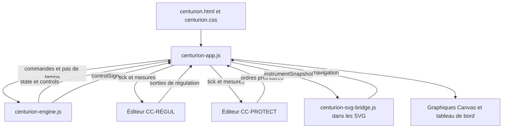

# Centurion — note de conception

Version documentaire du 6 octobre 2026. Cette note décrit le code présent dans le dépôt ; les numéros de ligne et le catalogue des interfaces sont régénérés par `node scripts/generate-docs.mjs`.

## 1. Objet et périmètre

Centurion est un simulateur pédagogique interactif de REP 1300 à quatre boucles. Une seule instance du moteur alimente les synoptiques, les historiques, les instruments et les deux ateliers de contrôle-commande. L'élève peut modifier les paramètres physiques, construire des régulations, provoquer des événements et observer leurs conséquences.

Le logiciel est une application statique : HTML, CSS, JavaScript, SVG et Canvas. Il fonctionne depuis un dossier local ou un hébergement statique. Il ne possède ni serveur de calcul, ni compte utilisateur, ni service de stockage distant. GitHub Pages publie les mêmes fichiers que ceux utilisés localement.

La simulation combine une cinétique neutronique globale, une forme axiale à 32 mailles, des bilans thermiques et des capacités hydrauliques équivalentes. Les transitoires accidentels, le DNBR et les critères de fin de partie sont des modèles d'exercice. Ils ne constituent pas un calcul de sûreté qualifié.

### Vues et parcours

| Ensemble | Contenu |
| --- | --- |
| Synoptiques | RCP général, Cœur, Diagramme P–T, Inventaire CPP, Pressuriseur, Grappes, GV sélectionné de 1 à 4 |
| Graphique | Historiques avec unités physiques, fenêtres de 5 min, 30 min, 1 h ou 4 h et navigation temporelle |
| CC-RÉGUL | Construction et exécution des chaînes de température, GCP, niveaux GV, pression et charge RCV |
| CC-PROTECT | Construction des logigrammes AAR, IS et démarrage ASG |
| Initiateurs | Brèche, éjection, retrait intempestif et perte de tension, après un décompte réel de 5 s |
| Transitoires | Programmes de charge, pause/reprise/interruption ; seul le suivi de charge boucle |
| Modèle | Détails par chapitres (cette note), seuils d'alarme et paramètres physiques modifiables |

## 2. Architecture logicielle



### Responsabilités des fichiers

| Fichier | Responsabilité | Dépendances |
| --- | --- | --- |
| `centurion-engine.js` | État physique, commandes, évolution, instruments, événements et historiques | JavaScript seul ; export CommonJS ou `window.CenturionEngine` |
| `centurion-app.js` | Horloge navigateur, conduite manuelle, arbitrage des sorties CC, navigation et dessins Canvas | Moteur, DOM, Canvas, fenêtres des éditeurs et SVG |
| `centurion-cc-regul.html` | Palette de blocs, graphes, évaluation, édition et sauvegarde | DOM, stockage local, messages du parent ; deux instances selon `mode` |
| `centurion-svg-bridge.js` | Application des mesures aux objets SVG, animations et renvois | DOM SVG et messages du parent |
| `centurion.html` / `centurion.css` | Structure des onglets, pupitre commun et présentation adaptative | Les trois scripts applicatifs et les fichiers SVG |
| `synoptiques/liaisons.json` | Inventaire des liaisons graphiques, utilisé pour vérification | Tests et documentation ; pas un moteur de calcul |
| `references.html` | Catalogue public de références sous identifiants REF-01 à REF-08 | Les documents sources eux-mêmes restent locaux |
| `tests/` | Tests du moteur, du vrai évaluateur CC et de l'intégration sur surfaces DOM/SVG simulées | Modules intégrés de Node.js |

Le RCP général, le pressuriseur, les grappes, le GV, l'inventaire et le diagramme P–T sont six fichiers SVG. Les quatre GV utilisent un même fichier avec substitution du numéro de train. La vue Cœur est un dessin Canvas ; elle n'a pas de SVG externe.

### Chargement

`index.html` redirige vers `simulateur/centurion.html`. Le moteur est chargé avant l'application. Celle-ci crée `model = CenturionEngine.make()`, raccorde les commandes, ouvre les vues et démarre sa boucle `requestAnimationFrame`.

Les deux éditeurs sont des iframes de la même page, respectivement `?mode=regul` et `?mode=protect`. La connexion est renouvelée à leur événement `load`. Les échanges `connect` / `ready` permettent aussi le raccordement si l'un des documents était déjà prêt. Chaque SVG contient le script de liaison et annonce son chargement au parent.

Au départ, l'horloge est en pause, CC-RÉGUL est désactivé et CC-PROTECT est activé. L'absence de régulation ne coupe pas la physique des équipements ni les manœuvres explicitement automatiques de l'exercice.

## 3. Modèle de données et conventions

L'objet racine est `{ state, controls }`. Les fonctions d'évolution modifient cet objet sur place. `state` contient les grandeurs réalisées et les mémoires du modèle ; `controls` contient les demandes, disponibilités et paramètres choisis. Un débit commandé ne doit jamais remplacer directement le débit mesuré dans une vue.

### État physique principal

| Chemin | Unité / format | Sens |
| --- | --- | --- |
| `state.time` | s simulées | Horloge physique |
| `powerPct` | % PN | Puissance neutronique de fission ; distincte de la puissance résiduelle |
| `fissionMW`, `decayMW`, `thermalPowerMW` | MWth | Fission, chaleur résiduelle et somme thermique |
| `electricMW` | MWe | Puissance réseau ; plafonnée à 1 300 MWe |
| `demandPct`, `turbinePct` | % | Demande et réponse turbine |
| `pressureBar` | bar absolus | Pression primaire |
| `tavgC`, `hotC`, `coldC`, `tRicC`, `lidC`, `fuelC` | °C | Moyenne primaire, BC, BF, sortie cœur avant bypass, couvercle et combustible |
| `primaryMassKg`, `vaporMassKg` | kg | Masse totale primaire et masse de vapeur retenue |
| `primaryEnergyJ`, `vaporEnergyJ` | J | Énergie primaire et contribution latente |
| `boronPpm`, `boronInventory` | ppm ; ppm·kg | Concentration du liquide et inventaire associé |
| `rods.R`, `rods.G1`, … | pas extraits | 0 = entièrement inséré ; 260 = entièrement extrait |
| `g3Count` | pas de chevauchement | Compteur condensé G1–G2–N1–N2 ; 780 au point tout extrait |
| `loops[0..3]` | tableau de 4 objets | Débits forcé/naturel en kg/s, températures, HMT et état de chaque GMPP |
| `gv[0..3]` | tableau de 4 objets | Masse secondaire, température/pression, niveaux, ARE/ASG et sorties vapeur |
| `axialShape32` | 32 valeurs sans dimension | P(z), moyenne arithmétique égale à 1 ; ordre du bas vers le haut |
| `iodine32`, `xenon32` | concentrations relatives | Stocks locaux, rapportés à l'équilibre nominal du modèle |
| `axialZonePowerPctPn32` | % PN par maille | Somme égale à `powerPct` |
| `fluxDetectors6` | 6 valeurs relatives | Moyennes idéales de la forme sur six sections RPN |
| `dpaxPctPn` | % PN | Somme des trois sections hautes moins somme des trois sections basses |
| `linearWcm32`, `peakLinearWcm` | W/cm | Profil de puissance linéique avec Fxy et maximum |
| `fDeltaH`, `dnbr` | sans dimension | Facteur d'élévation d'enthalpie et indicateur DNBR simplifié |
| `tripDemandAt`, `tripAt`, etc. | s ou `null` | Horodatage d'une demande, puis de son effet physique |
| `history`, `events` | tableaux | Échantillons physiques et journal d'événements |
| `endState` | `null`, `melted`, `safe` | État de fin de partie |

Les variables publiques du moteur ne sont pas toutes reprises dans ce tableau. Le [catalogue généré](index.html#api) donne les signatures exportées ; le dictionnaire complet des signaux CC est généré à partir de `controlSignals(make())`.

### Commandes et paramètres

| Famille | Exemples dans `controls` |
| --- | --- |
| Turbine | `demandPct`, état du transitoire |
| Grappes | `rMode`, `rManualPas`, `rGraphPas`, `rManualOverride`, `allRodsTargetPas`, `g3GraphTarget`, `gcpCalibrationPct` |
| GV | `gvManualFeedPct[4]`, `gvGraphFeedPct[4]`, `gvSteamValvePct[4]`, `gvLevelSetpointPct`, `gctAOpeningPressureBar` |
| PZR | `manualHeaterKW`, `manualSprayPct`, `pressureGraphHeaterKW`, `pressureGraphSprayPct`, `manualReliefStages[3]`, `manualAuxiliarySprayM3h` |
| RCV | `rcvChargeM3h`, `rcvChargeGraphM3h`, `rcvTankBoronPpm`, `rcvLetdownOrifices[3]`, `rcvInjectionMode` |
| Sauvegarde | `asgManual`, `asgTrainEnabled[4]`, `risPumpMode`, `risSourceMode`, disponibilités MP/BP |
| Physique | `rodWorthPcm`, `axialRodAbsorption`, `coolantWorthPcmC`, `dopplerWorthPcmC`, `xenonEquilibriumWorthPcm`, `fxYUngraped`, `fxYGraped` |

Une sortie CC absente prend généralement la valeur `null`, pour laisser la conduite manuelle correspondante. Une sortie nulle est une commande valide : elle ne doit pas être confondue avec une sortie absente. Les commandes PZR sans nouvelle sortie finie maintiennent leur valeur précédente tant que le mode graph reste sélectionné.

### Projection instrumentale

`instrumentSnapshot(model, selectedGv)` construit la projection commune aux instruments. Il renvoie notamment `gvState` pour le GV choisi, `gvAll`, `loops`, `rods`, les débits convertis, les indicateurs de niveau et les alarmes de domaine. Les numéros de GV sont compris entre 1 et 4 ; les tableaux JavaScript commencent à l'indice 0.

Cette projection ne constitue pas une copie profondément immuable de tout le modèle : certains objets comme `inventory` sont partagés avant l'envoi. `postMessage` copie les données entre documents. Les consommateurs doivent les lire, pas les utiliser comme commandes ni modifier l'état source.

## 4. Horloge et séquencement

### Boucle du navigateur

L'application accumule le temps réel multiplié par la vitesse sélectionnée, puis appelle `step(model, 0.1)` autant de fois que nécessaire. Un paquet est limité à 150 pas, soit 15 s simulées par image navigateur. Le delta réel par image est plafonné à 0,15 s. Ce mécanisme évite une accumulation sans limite après une suspension de l'onglet.

Après le paquet physique, l'application envoie un tick aux éditeurs. Les réponses sont asynchrones et s'appliquent aux pas suivants. Les CC ne sont donc pas exécutés en synchronisme avec chacun des sous-pas de 0,1 s. À ×200, le pas d'un filtre CC peut atteindre 15 s alors que la physique conserve ses sous-pas. Ce choix est une limite de résolution des boucles à grande accélération.

Le dessin est rafraîchi environ toutes les 120 ms réelles. En pause, les éditeurs reçoivent encore les mesures avec `dt=0` : affichages et changements de paramètres restent visibles, sans faire évoluer les mémoires dynamiques des blocs.

### Ordre d'un pas physique

1. Évolution du programme turbine, TREF, IL de R, paramètres RCV et brèche.
2. Évaluation des informations de protection et réalisation des demandes déjà mémorisées.
3. Mouvement des grappes, réactivité globale et cinétique ponctuelle.
4. Fission, chaleur résiduelle et inventaire servant au débit des boucles.
5. Débits forcé/naturel, échange combustible–primaire, bilans des quatre GV et température combustible.
6. Brèche, RIS, accumulateurs, transit des injections RCV/RIS et bilan masse/bore/énergie primaire.
7. Actionneurs PZR, pression, séparation sensible/latent, températures BF/BC/RIC/couvercle.
8. Iode/xénon, forme axiale, PLIN, DNBR, domaines, critère de dommage.
9. Incrément d'horloge et éventuel échantillon historique.

Les couplages utilisent ainsi des états successifs à l'intérieur du pas. Il ne s'agit pas d'une résolution simultanée de toutes les équations. `advance(model, seconds, dt)` est un outil de calcul sans interface : il répète les sous-pas physiques et n'exécute pas les graphes CC du navigateur.

### Historiques et temporisations

Un échantillon est enregistré environ chaque seconde simulée ; la mémoire conserve au plus 28 800 échantillons, soit environ 8 h. Les fenêtres de 5 min à 4 h filtrent cette mémoire sans changer le pas physique. Le journal conserve les 240 derniers événements.

Le décompte de lancement d'un initiateur dure 5 s **réelles**. Les délais AAR/IS/ASG, transits, décroissance résiduelle et seuil de dommage sont exprimés en **secondes simulées**. Pendant le décompte de dommage, l'application force ×1 et abandonne le reliquat de temps accéléré.

## 5. Lois physiques implémentées

### 5.1 Réactivité globale et cinétique

La réactivité est la somme suivante, en pcm, relative au point nominal initial :

```text
rho = rho_grappes + alphaB × (CB − CB0)
    + alphaM × (TMOY − TMOY0) + alphaD × (TCRA − TCRA0)
    + WXe_nominal − WXe_nominal × moyenne(Xe)
```

Les coefficients modérateur et Doppler sont signés. Les valeurs par défaut sont −30 pcm/°C et −2,6 pcm/°C. Le bore initial vaut 1 200 ppm, avec −7 pcm/ppm. Le xénon à l'équilibre nominal vaut 3 000 pcm d'antiréactivité ; le terme de référence compense ce poids au point initial et ne suit pas le stock de xénon lors d'un transitoire.

La puissance est calculée par une cinétique ponctuelle à six groupes de précurseurs. Le schéma emploie un dénominateur implicite pour la population neutronique, puis une mise à jour implicite des précurseurs. Le code borne la réactivité injectée dans ce calcul entre −0,15 et 0,012 (sans dimension) et la puissance entre un plancher numérique et 300 % PN. Ces bornes protègent le modèle réduit ; elles ne décrivent pas une saturation physique générale du réacteur.

### 5.2 Grappes et G3

L'efficacité d'un groupe utilise une courbe intégrale en S :

```text
F(p) = (1 − cos(pi × p / 260)) / 2
rho_grappes = somme[ Wg × (F(pg) − F(pg_initial)) ] + effet_ejection
```

R commence à 233 pas extraits ; les autres groupes à 260. Les poids par défaut sont R 1 500, G1 200, G2 480, N1 750, N2 1 200, SA 500, SB 700, SC 900 et SD 300 pcm. Ils sont des paramètres d'étude choisis pour ce simulateur.

G3 est une table interpolée selon la puissance vue et la campagne. Son ancrage à 100 % est 780 pas de chevauchement. Les quatre positions sont obtenues à partir de `counter − 520` et des décalages `[0, 185, 360, 515]`, puis limitées à 0–260 : les recouvrements sont 75, 85 et 105 pas. Il n'y a pas d'IL GCP dans cet exercice.

L'IL de R vaut `202 − 0,16 × P` en première moitié de cycle et `211 − 0,13 × P` en seconde moitié. Son franchissement déclenche un clignotement ; il ne bloque pas le mouvement. La limite droite DPAX est la ligne brisée `(0,0) → (15,15) → (6,100)`, avec DPAX en abscisse et puissance en ordonnée.

### 5.3 Forme axiale et poisons

La hauteur active de 4,2672 m est divisée en 32 mailles. Un opérateur tridiagonal de diffusion/absorption 1D répartit la puissance ; son mode fondamental positif est obtenu par itération inverse, au maximum 60 itérations, et normalisé à une moyenne de 1.

L'absorption locale dépend de l'insertion des grappes, du xénon et de l'écart de température du modérateur. Les coefficients de forme axiale des groupes sont **distincts** des poids intégraux en pcm. Leur modification change la distribution et le DPAX sans ajouter une seconde efficacité au bilan neutronique global.

Les six détecteurs idéaux intègrent les recouvrements entre les 32 mailles et leurs six sections. La courbe affichée est lissée par interpolation cubique préservant les extrema. L'interpolation est graphique ; elle ne remplace pas les 32 valeurs de calcul.

Le modèle local des poisons utilise :

```text
dI/dt  = lambdaI × (puissance_locale_relative − I)
dXe/dt = facteur_production × (lambdaXe + capture_nominale) × I
       − (lambdaXe + capture_nominale × puissance_locale_relative) × Xe
```

Les demi-vies sont 6,6 h pour l'iode et 9,1 h pour le xénon. La production d'iode suit immédiatement la puissance ; son **stock** garde la mémoire de cette irradiation. La moyenne Xe agit sur la réactivité globale, tandis que sa distribution agit sur la forme. La préparation du point initial recherche un équilibre axial couplé. Le facteur `timeScaleXenon` est distinct de la vitesse générale et vaut 1 au départ.

### 5.4 Puissance linéique et DNBR

À chaque maille, une table Fxy est sélectionnée suivant les groupes qui occupent cette cote. L'occupation partielle de la maille traversée par une pointe est interpolée. La valeur non grappée par défaut est 1,4 ; le multiplicateur de la table grappée est 1. La cote 0 prolonge la cote 1 de la table fournie. Une correction d'étude `1 + 0,3 × (1 − puissance_thermique_relative)` est appliquée à puissance inférieure au nominal.

```text
Q(z) = P(z) × Fxy(z)
PLIN(z) = 170,23 × (Pthermique / 3817) × Q(z)       [W/cm]
FDeltaH = moyenne[Q(z)]
FQ = max[Q(z)]
```

Le DNBR est un indicateur local utilisant la pression, le débit et le sous-refroidissement du canal chaud, puis normalisé pour donner 1,65 au nominal. Son minimum sur 32 mailles est affiché. Le calcul d'enthalpie utilise Cp constant et suppose les facteurs de mélange/redistribution égaux à 1. Aucune corrélation industrielle complète de flux critique n'est implémentée.

Le dessin de P(z) a une échelle fixe 0–2 ; les 32 barres PLIN utilisent 0–435 W/cm. Le seuil de protection est 435 W/cm ; le seuil de fin de partie est 590 W/cm pendant plus de 5 s.

### 5.5 Combustible, primaire et changement de phase

L'échange combustible–primaire est `Q = K × (TCRA − TMOY)`, avec K fixe à 10 MW/°C et capacité thermique combustible de 45 MJ/°C. La même puissance est retirée du combustible et ajoutée au primaire. Le combustible peut dépasser la température de saturation ; les températures d'eau sont limitées à cette saturation.

Le primaire a un inventaire nominal de 269 064 kg, Cp effectif 6 000 J/(kg·°C) et débit nominal total de 17 588 kg/s. Il n'est pas multiplié par quatre. Les bilans comptent les injections arrivées, les décharges, la brèche et les soupapes. La température moyenne est déduite de l'énergie ; l'énergie excédant le liquide saturé devient une contribution latente et une masse de vapeur.

La pression de saturation utilise l'équation de la région 4 IF97 ; son inverse est recherché par dichotomie. La chaleur latente primaire est interpolée sur une table. La décomposition liquide/vapeur reste homogène et approchée : densité liquide et Cp ne proviennent pas d'une équation d'état complète.

Le calcul BF/BC retire la contribution de vaporisation à la chaleur sensible et borne l'écart de température par la saturation. Il ne divise pas par un débit nul. T RIC est la température moyenne de sortie cœur avant le mélange avec 7 % de bypass ; les branches chaudes représentent la sortie après mélange. La température du couvercle est bornée par la saturation.

La chaleur résiduelle est séparée de la puissance neutronique : après AAR ou arrêt normal identifié par la commande de tous les groupes, elle suit une loi d'étude commençant vers 7 % du nominal et décroissant en `(1 + temps_depuis_arret)^−0,2`. Cette chaleur chauffe réellement le combustible.

### 5.6 Débits primaire, thermosiphon et inventaire

En marche, une GMPP vise le débit nominal de sa boucle. Une baisse turbine ne doit pas diminuer ce débit. Un arrêt mémorisé des GMPP résulte d'une perte de tension ou d'une demande IS ; l'AAR seul ne les arrête pas. Le débit forcé décroît avec une constante de 15 s et est mis à zéro sous 2 % du nominal, soit environ une minute de décélération.

La circulation naturelle dépend de l'écart thermique primaire–GV, du niveau secondaire, de la couverture cœur et de l'amorçage de la boucle. Elle prend progressivement le relais du débit forcé, autour de 250 kg/s par boucle, au maximum 300 kg/s. Le RIS livré participe au débit cœur ; sur une brèche BF, l'exercice suppose un court-circuit de 50 % de l'injection de la boucle rompue, soit 12,5 % du débit total.

`cppInventory` distribue la masse liquide dans des capacités équivalentes selon leur altitude. Le PZR absorbe d'abord la variation normale, les boucles restant pleines. Une surface libre schématique descend dans les capacités après épuisement de cette réserve. Les quatre faisceaux ont des altitudes légèrement décalées pour représenter un désamorçage progressif. Cette géométrie est un modèle de visualisation et de capacité, pas une description dimensionnelle certifiée.

### 5.7 GV et vapeur

Chaque GV possède sa masse et son bilan d'énergie : capacité d'eau variable plus 100 MJ/°C de métal équivalent. La masse secondaire nominale est d'environ 63,8 t par GV. L'inventaire primaire est compté dans le bilan primaire, pas ajouté une seconde fois à cette capacité.

L'échange primaire–GV dépend de l'écart TMOY–température secondaire, du débit de la boucle et de l'inventaire secondaire. ARE apporte de l'eau à 245 °C ; ASG à 20 °C. La vapeur évacuée emporte l'enthalpie sensible et une chaleur latente effective dépendant de la pression. La pression secondaire est déduite de la température par la saturation.

Le débit vapeur total d'un GV est la somme VPU + GCT-A. Le limiteur turbine plafonne le débit utilisé par la turbine à sa demande et la puissance réseau à 1 300 MWe. Une hausse de puissance cœur ne relève pas cette consigne. La pression peut limiter la vapeur réellement disponible.

Les GCT-A modulent autour de leur pression d'ouverture manuelle, 88,6 bar au départ. Leur capacité maximale et leur bande sont des lois d'étude. ARE s'arrête après AAR ou perte de tension. ASG démarre sur ordre CC-PROTECT ou manuel ; l'AAR n'ajoute pas un second démarrage caché dans le moteur.

Le débit ASG par GV interpole 127, 140, 152, 157 m³/h aux pressions 80, 60, 40, 30 bar ; hors plage, les extrêmes sont maintenus. Deux trains sont de type TPS et deux MPS. Les MPS attendent le secours diesel en perte de tension ; les TPS restent disponibles. Le haut niveau GE >90 % coupe aussi le manuel ; en automatique, la reprise sous 10 % suppose un ordre ASG préalablement réalisé.

### 5.8 PZR et RCV

La pression primaire évolue avec les changements de masse, de température moyenne et le bilan thermique effectif du PZR. Ce dernier comporte chauffe, aspersion et échange passif calibré au nominal. Il ne s'agit pas d'un modèle séparé vapeur/liquide détaillé du PZR.

Les deux lignes réglantes d'aspersion prennent leur eau en BF1/BF2. À ouverture 100 %, chacune débite 125 m³/h aux conditions nominales ; chacune possède aussi 0,230 m³/h continus. L'ouverture est linéaire en débit à pression motrice nominale, puis multipliée par `sqrt(deltaP / 3,5 bar)`. La pression motrice suit le carré du débit forcé GMPP. L'ouverture évolue à 50 %/s. L'aspersion auxiliaire manuelle détourne jusqu'à 8 m³/h de charge RCV vers le PZR, sans ajouter une nouvelle masse injectée.

La charge RCV totale vaut jusqu'à 36 m³/h, dont 6 vers les joints et 30 sur la charge directe équivalente. Les orifices de décharge donnent chacun 18 m³/h ; deux sont ouverts au départ. QCHARGE peut être commandée par le CC de niveau. La CB reste manuelle. Les boutons dilution/borication imposent temporairement 0/7 000 ppm à la charge existante, restaurent ensuite la CB réglée et comptent les litres **arrivés** après 8 s de transit.

Les conversions RCV utilisent la densité primaire équivalente de 720 kg/m³. Le RIS froid et l'ASG utilisent 1 000 kg/m³. Un débit en kg/s ne se convertit donc pas toujours avec la même densité.

### 5.9 RIS, accumulateurs et recirculation

Les lois MP/BP dépendent de la pression primaire, des disponibilités, du délai d'ordre, de l'alimentation et du stock de la source. L'injection directe prend une réserve de 600 t, à 20 °C et 2 500 ppm par défaut ; la recirculation reprend masse, bore et énergie du puisard modélisé. Les apports arrivent après transit ; les courbes distinguent débit pompé et débit livré.

Les accumulateurs sont des capacités passives avec azote polytropique. La pression d'azote baisse avec la vidange ; le débit suit la racine de la différence de pression positive. Une inertie hydraulique d'étude de 1 s évite une commutation brutale ; le transit vaut 1 s. L'arrêt manuel des pompes RIS ne ferme pas ces capacités passives. Leur autorisation reste cependant reliée à la demande IS dans le modèle actuel.

La brèche utilise le minimum d'une loi d'orifice et d'un flux critique borné. Un partage liquide/vapeur dépend de la fraction de vide homogène et de la branche rompue. Le puisard reçoit les sorties modélisées ; il n'existe pas de modèle complet d'enceinte.

## 6. Contrôle-commande et priorité

### Parcours étudiant et corrections

Lors d'une première ouverture, les deux ateliers ont un canevas vide et sont inactifs. L'élève choisit les mesures, assemble les blocs et relie les sorties aux actionneurs. Une sauvegarde existante est restaurée sans être effacée ; sa commande reste inactive au chargement. Le bouton Effacer permet de commencer un nouvel exercice, avec possibilité d'annuler.

Le bouton Solutions ouvre des paliers protégés par un code pédagogique. L'aide-mémoire est rangé dans Modèle → Détails → Compléments, dans un volet fermé. Les codes à quatre chiffres y sont écrits de droite à gauche ; l'étudiant inverse leur ordre avant la saisie. Les solutions sont numérotées de 1 à 6 en régulation et de 1 à 3 en protection. Ces codes organisent le déroulement du TP ; ils ne contrôlent pas l'accès aux fichiers publics.

| Atelier | Paliers |
| --- | --- |
| CC-RÉGUL | Trois historiques : température simplifiée ; température + niveau PZR ; température + niveau + pression PZR. Deux chaînes ciblées : niveaux des quatre GV ; GCP/G3. Enfin Complet : toutes les chaînes, avec les correcteurs G1/G2 de température. |
| CC-PROTECT | Les principaux AAR ; AAR + IS ; AAR + IS + ASG complet. |

Les solutions complètes sont les deux fichiers `modele-de-regulation.simurep_complet.json` et `modele-de-protection.simurep_complet.json`. Leurs blocs, paramètres et positions sont conservés. Les chaînes ciblées et paliers de protection sont extraits de ces graphes. Le premier palier de protection exclut la branche IS et la commande ASG. Le deuxième reprend la branche IS, y compris sa demande d'AAR ; seul le troisième ajoute ASG.

Charger une solution remplace le graphe du seul atelier concerné et désactive sa commande. Une confirmation est affichée si le canevas contient déjà des blocs. Annuler retrouve le travail précédent. Les solutions ciblées remplacent le canevas : elles ne s'ajoutent pas au graphe courant. Aucun ordre de protection n'est greffé automatiquement à un nouveau schéma ou à un palier partiel.

### Évaluateur de graphes

Un graphe comporte des nœuds `{id, type, x, y, label, params}` et des liaisons `{from, to, toPort}`. La palette possède des sources, des opérateurs statiques, des tables, filtres, dérivateurs filtrés, intégrateurs, PI/PID et opérateurs logiques. Les états des blocs dynamiques sont stockés par identifiant de nœud, séparément du modèle sérialisé.

`evaluateRegulationGraph` parcourt les liaisons entrantes, mémorise les résultats du tick et détecte les cycles algébriques. Une valeur finie et une unité accompagnent chaque signal. Les sorties envoyées au parent sont numériques et doivent être connectées. Les diagnostics sont retournés ; une entrée manquante peut valoir zéro selon le bloc, ce qui nécessite une vérification du graphe par son auteur.

Les deux instances ont des graphes, états dynamiques et sauvegardes distincts. Les migrations s'appliquent aux anciennes chaînes identifiables (ancienne sortie de décharge, conversion pas→% ou source dérivée obsolète) et cherchent à préserver les valeurs personnalisées. Le JSON de test historique vérifie ce contrat sans publier l'ancien simulateur complet.

### Chaîne de température de référence

La correction complète conserve la chaîne filtrée et compensée. Ses paramètres restent visibles et modifiables dans les blocs. Les fonctions G1/G2 du correcteur ci-dessous sont distinctes des groupes de grappes portant les mêmes noms.

| Branche | Traitement de la correction complète |
| --- | --- |
| Consigne | PTUR → programme TREF (297,2 à 306,5 °C) → filtre de 60 s |
| Température | TMOY − TREF filtrée → avance–retard (1 + 50s)/(1 + 6,7s) → filtre de 1 s |
| Puissance | POW1 et PTUR filtrés séparément à 2 s → différence → passe-haut de 50 s → G1 × G2 |
| G1, fonction du correcteur | 0,4 °C par % PN près de zéro, puis pente accrue, plateau ±6 °C |
| G2, gain programmé | 4 sous 25 % ; 2 à 50 % ; 4/3 à 75 % ; 1 à 100 % |
| Mouvement R | Somme des deux branches → hystérésis : démarrage à 0,83 °C, arrêt à 0,55 °C |
| Vitesse et position | 8 à 72 pas/min suivant l'écart → inhibition d'extraction à haute puissance → intégration de 0 à 260 pas extraits |

Un écart positif insère R, un écart négatif l'extrait. L'inhibition vise l'extraction ; une insertion commandée reste possible. Le tableau de bord affiche le programme TREF instantané, tandis que l'atelier affiche la TREF filtrée utilisée par la boucle. Avec xénon actif après baisse de puissance, la dilution reste une action manuelle.

### Correspondance sorties → commandes

| Sortie CC | Cible | Conditions / unité |
| --- | --- | --- |
| `posg` | `rGraphPas` | CC-RÉGUL actif, pas extraits 0–260, hors surcharge R manuelle |
| `g3Out` | `g3GraphTarget` | Compteur de chevauchement ; correction de campagne appliquée par le parent |
| `gv1Out` … `gv4Out` | `gvGraphFeedPct` | Ouverture demandée ARE, % |
| `pchauffOut` | `pressureGraphHeaterKW` | Puissance chauffe, kW |
| `qaspOut` | `pressureGraphSprayPct` | Ouverture aspersion, % |
| `nrefOut` | `nrefGraphPct` | Référence niveau PZR, % |
| `qchargeOut` | `rcvChargeGraphM3h` | Débit total de charge, borné à 6–36 m³/h |
| `aarOut` | demande AAR mémorisée | CC-PROTECT actif ; signal ≥0,5 |
| `risOut` | demande IS mémorisée | CC-PROTECT actif ; signal ≥0,5 ; implique demande AAR et arrêt GMPP |
| `asgOut` | demande ASG mémorisée | CC-PROTECT actif ; signal ≥0,5 |

Au retour manuel, le pupitre reprend les positions et débits réalisés. Les glissières désactivées continuent à suivre les valeurs appliquées. PTUR, le décalibrage GCP et la CB restent manuels. La case R en manuel neutralise seulement la sortie R ; son intégrateur est suivi sur la position réelle pour limiter le saut à la reprise.

### Arbitrage

1. AAR réalisé : chute de tous les groupes et arrêt turbine ; aucune régulation ni commande de levée normale ne peut relever les grappes.
2. IS et perte de tension : effets mémorisés, disponibilités et arrêt GMPP ; les manœuvres RIS/ASG prévues restent accessibles.
3. Commande manuelle de tous les groupes : priorité de manœuvre sur les sorties de position, sans créer d'AAR ni de CIA par elle-même.
4. Surcharge R manuelle : priorité sur R uniquement.
5. Sorties CC actives et finies ; puis commandes manuelles de repli.

Les alarmes du tableau de bord et les clignotements de domaine ne déclenchent pas d'ordres. Les limitations physiques, la temporisation des effets, le GCT-A et la coupure ASG haut niveau demeurent dans le moteur. Un mode de protection interne par seuils existe pour utiliser le moteur seul ; l'application fixe `protectionGraphMode=true` pour faire provenir les ordres automatiques du graphe CC-PROTECT.

## 7. Contrats entre documents et synoptiques

### Messages `postMessage`

| Type | Sens | Charge utile principale |
| --- | --- | --- |
| `centurion-editor-connect` | Parent → éditeur | Demande de raccordement |
| `centurion-editor-ready` | Éditeur → parent | `mode`: `regul` ou `protect` |
| `centurion-editor-enable` | Parent → éditeur | `enabled`, `signals`, éventuellement `rManualOverride` |
| `centurion-editor-enabled` | Éditeur → parent | État de commande après action dans l'atelier |
| `centurion-editor-tick` | Parent → éditeur | `dt`, `signals`, `rManualOverride` |
| `centurion-editor-outputs` | Éditeur → parent | `mode`, `enabled`, `outputs`, `fluxRatePctS`, `diagnostics` |
| `centurion-editor-reset` | Parent → éditeur | Mesures initiales et état d'activation |
| `centurion-state` | Parent → SVG | Projection instrumentale, courbes/trace P–T si nécessaires |
| `centurion-svg-ready` | SVG → parent | Vue chargée, demande de rafraîchissement |
| `centurion-svg-navigate` | SVG → parent | Nom de vue et numéro GV éventuel |

Le dictionnaire `signals` contient des paires `[valeur, unité]`. Les identifiants logiciels (`pow1`, `posg`, etc.) sont des clés de contrat ; un changement de libellé affiché ne doit pas les renommer. `posg` représente désormais des **pas extraits**. `posgInternalPct` reste une compatibilité interne de l'ancien atelier, pas une unité de conduite.

### Liaisons SVG

Les nouveaux SVG utilisent des attributs sémantiques. `data-value` donne le chemin dans la projection ; `data-template`, `data-decimals` et `data-unit` contrôlent le texte. `data-actuator` et `data-pump` suivent l'état réalisé. `data-level-value`, `data-line-value` et `data-follow-level` pilotent remplissages, traits et labels. `data-gv-template` substitue le numéro de train.

Exemple :

```xml
<text data-value="gvState.pressureBar" data-template="{value}"
      data-decimals="1" data-unit="bar abs.">—</text>
```

Une valeur absente/non finie apparaît sous forme de tiret. Les éléments portent aussi `data-current-value`, utile à la vérification de cohérence. La vue Grappes conserve des liaisons par identifiant dans le pont ; toutes les vues ne sont donc pas encore exclusivement sémantiques.

## 8. États, incidents et fin de partie

RP est l'état de production. AN/GV est reconnu lorsque la puissance neutronique est ≤0,01 % PN et la réactivité négative. Une demande ou réalisation AAR/IS place le modèle en CIA ; les états standards ne s'appliquent alors plus.

Le clignotement P–T en RP utilise 150–160 bar et 297,2–307,5 °C. En AN/GV, il utilise les limites plus strictes de `ptLimits` et la borne haute de température propre à cet état. En CIA, ce clignotement standard est désactivé. La vue conserve le point réel et sa trace, même hors domaine.

La connexion RRA exige TMOY 90–180 °C, P 25–31 bar, puissance neutronique ≤0,01 % PN et cœur couvert. Elle n'exige ni AAR préalable, ni seuil de réactivité. La connexion marque `endState="safe"` et arrête la simulation : elle ne poursuit pas une simulation détaillée de refroidissement RRA.

Le risque de dommage débute si PLIN >590 W/cm ou si le niveau tombe sous le haut du cœur. Une récupération annule la temporisation. Un dépassement continu de plus de 5 s marque `endState="melted"`. Une fin de partie bloque les nouveaux pas physiques ; réinitialiser crée un nouvel objet modèle et annule l'initiateur en attente.

## 9. Paramètres, sauvegardes et publication

Les paramètres physiques sont portés par `controls`, initialisés à partir des constantes `C` et des tables. Les saisies et la molette doivent appliquer les valeurs immédiatement, même en pause. Les poids intégraux et les paramètres de forme sont distincts. Réinitialiser rétablit les paramètres physiques par défaut ; les graphes des ateliers ont leur propre persistance.

Le navigateur conserve les modèles CC dans `localStorage`, sous `centurion-regul-autosave-v1` et la clé équivalente de protection. Les modèles JSON exportés utilisent le format `SimuREP-Regulation`, version 1. La sauvegarde porte le graphe et la vue de l'atelier ; elle ne sérialise pas tout l'état physique ni l'historique d'une partie.

Les documents sources et les archives de propositions ne sont pas publiés. Le catalogue public emploie des identifiants REF ; leur correspondance avec les fichiers locaux reste privée. Les exclusions d'anciens prototypes figurent dans `scripts/publication-exclusions.json`. Les ressources actives, les tests actuels et cette documentation restent dans le dépôt public.

Les fichiers d'une application statique publique sont téléchargeables. Il n'y a pas d'authentification dans ce code. Un contrôle d'accès réel requiert une couche d'hébergement appropriée ; voir [l'étude d'accès web](../simulateur/ACCES-WEB.md). Les secrets de publication ne doivent figurer ni dans le JavaScript, ni dans la documentation, ni dans les URL Git enregistrées.

## 10. Vérification et maintenance

### Commandes reproductibles

```sh
node --test simulateur/tests/*.test.js
node scripts/generate-docs.mjs
node scripts/check-docs.mjs
```

Les tests utilisent les modules intégrés de Node.js. Ils couvrent les bilans et l'évolution du moteur, les fonctions du vrai évaluateur CC, les commandes manuelles, les temporisations, les transitoires, les SVG et les graphiques. Plusieurs surfaces DOM/Canvas sont remplacées par des objets de test : ces essais vérifient la logique, pas le rendu complet de chaque navigateur ni une validation scientifique du modèle.

### Ajouter ou modifier une mesure

1. Identifier la grandeur réalisée et son unité dans `state`.
2. L'exposer dans `instrumentSnapshot` si elle est instrumentale, et dans `controlSignals` si elle doit devenir source CC.
3. Déclarer la source dans la palette CC et son unité ; garder les clés stables.
4. Raccorder le SVG par chemin sémantique et mettre à jour `liaisons.json`.
5. Vérifier la même valeur dans le moteur, la source CC, le pupitre et le SVG ; ne pas réutiliser la valeur de commande comme mesure.
6. Régénérer la documentation et l'index, puis contrôler les liens.

### Ajouter une sortie CC

Créer le bloc de sortie, l'exposer dans l'évaluateur, l'appliquer dans `applyEditorOutputs` et définir son arbitrage dans le moteur. Prévoir une valeur absente, un zéro valide, le retour manuel et les protections prioritaires. La migration éventuelle d'un modèle existant doit préserver les graphes personnalisés.

### Points de maintenance connus

| Point | Conséquence / prochaine séparation utile |
| --- | --- |
| Atelier CC monolithique avec éléments hérités inactifs | Extraire à terme évaluateur, palette, stockage et UI ; le nettoyage public retire les dépendances externes obsolètes sans réécrire cet atelier |
| CC asynchrones après paquets de pas | À grande accélération, vérifier les réponses des filtres ; une exécution CC en cadence physique fixe serait une évolution distincte |
| Messages adressés à `*` | Nécessaires au fonctionnement local actuel ; le pont SVG vérifie le parent, mais les échanges de l'application et de l'atelier n'ont pas tous une validation d'origine/source stricte |
| Forme axiale homogénéisée et RPN idéales | Absence de modèle radial et de réponse ex-cœur réelle ; les Fxy tabulés ne constituent pas une reconstruction instrumentale complète |
| Lois hydrauliques/diphasique réduites | Densité/Cp effectifs, capacités schématiques, brèche et DNBR à documenter lors de tout recalage |
| Aucun instantané de partie complet | Une reprise exacte nécessiterait état physique, commandes, mémoires CC, transit et horloges sérialisés ensemble |

Le générateur de documentation extrait les fonctions nommées et les exports réellement présents. L'index inclut des fonctions internes et des fonctions héritées du fichier d'atelier ; leur présence dans l'index ne signifie pas qu'elles sont exécutées par le simulateur actuel.

## 11. Références et documents associés

- [Mode d'emploi](../simulateur/README.md).
- [Équations, chronologie des choix et hypothèses](../simulateur/METHODE-CENTURION.md).
- [Catalogue de références](../simulateur/references.html).
- [Journal de nettoyage du dépôt](NETTOYAGE.md).
- [Index HTML et API](index.html#api).

La note et l'index décrivent la version présente du code. Les liens de source en ligne utilisent la branche `main` du dépôt ; ils doivent être régénérés après une modification pour conserver des numéros de ligne exacts.
